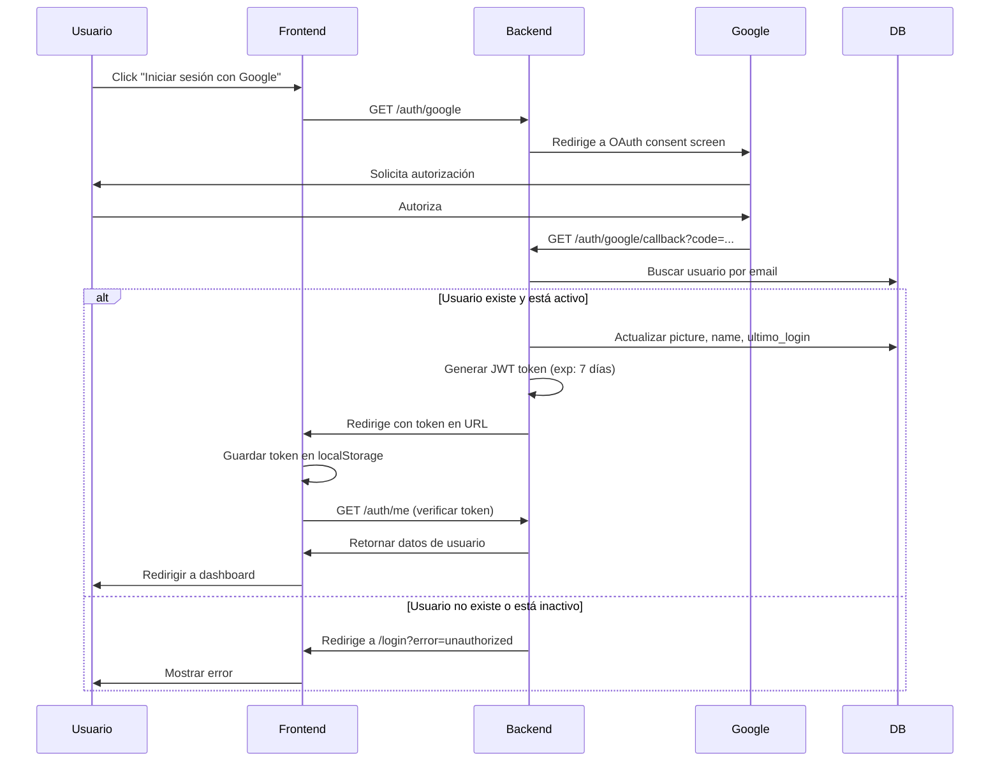
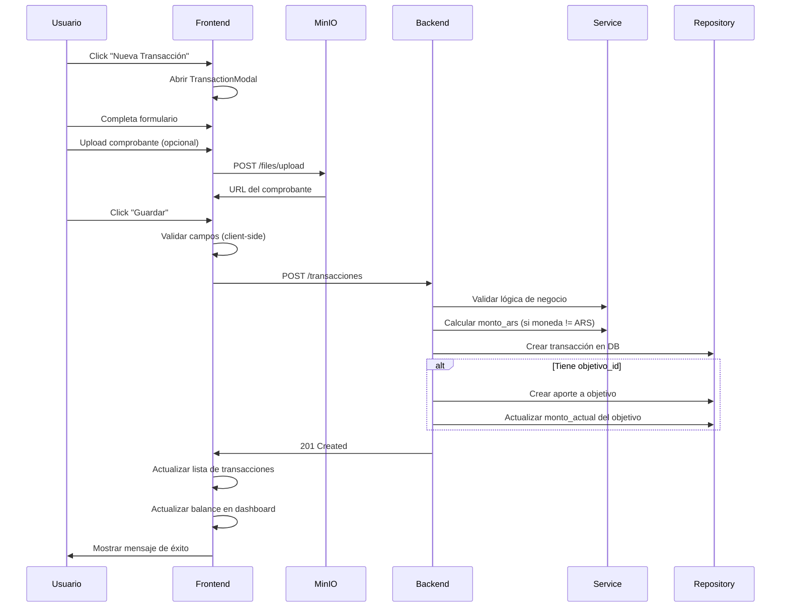
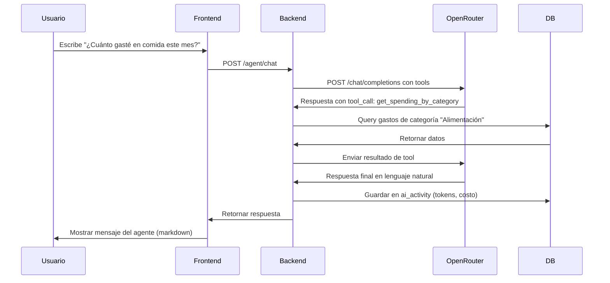
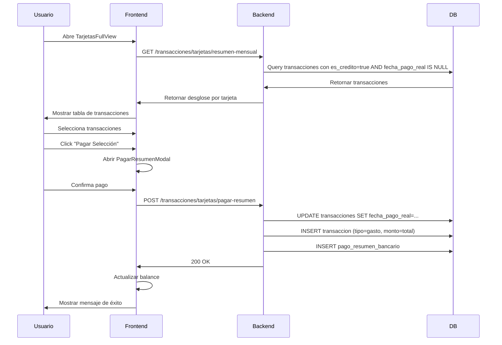
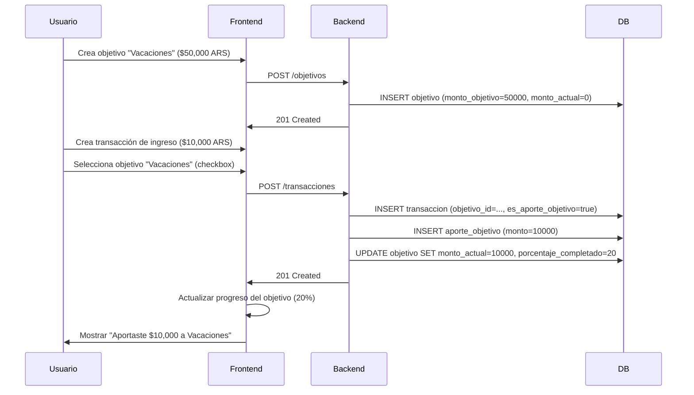
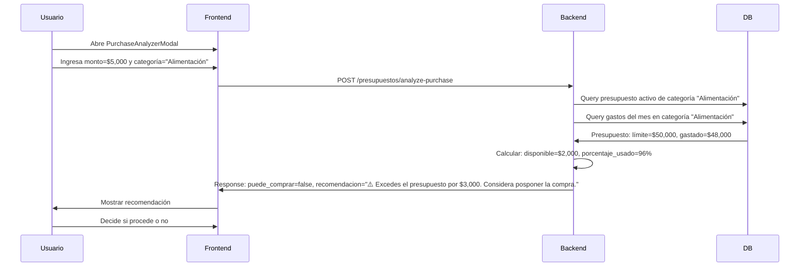

# PRD - Sistema de Gastos Inteligente

> **Product Requirements Document v2.0**  
> **Fecha**: 2026-02-07  
> **Propósito**: Especificación completa y exhaustiva para testing con TestSprite

---

## 📋 Tabla de Contenidos

1. [Visión General](#-visión-general)
2. [Objetivos del Producto](#-objetivos-del-producto)
3. [Stack Tecnológico](#-stack-tecnológico)
4. [Arquitectura del Sistema](#-arquitectura-del-sistema)
5. [Modelos de Datos](#-modelos-de-datos)
6. [Funcionalidades Core](#-funcionalidades-core)
7. [APIs y Endpoints](#-apis-y-endpoints)
8. [Componentes Frontend](#-componentes-frontend)
9. [Flujos de Usuario](#-flujos-de-usuario)
10. [Reglas de Negocio](#-reglas-de-negocio)
11. [Requerimientos No Funcionales](#-requerimientos-no-funcionales)
12. [Criterios de Aceptación](#-criterios-de-aceptación)
13. [Matriz de Testing](#-matriz-de-testing)

---

## 🎯 Visión General

**Sistema de Gastos Inteligente** es una plataforma full-stack de gestión financiera personal que combina:

### Características Principales

- ✅ **Gestión de Transacciones Multi-Moneda** (ARS, USD, EUR, BRL, GBP + personalizables)
- ✅ **Objetivos de Ahorro** con tracking visual y aportes automáticos
- ✅ **Gestión de Deudas de Tarjetas de Crédito** completa
- ✅ **Agente IA Conversacional** con function calling (6 herramientas)
- ✅ **Dashboard Personalizable** con 12+ widgets interactivos
- ✅ **Multi-Tenancy** (cada usuario ve solo sus datos)
- ✅ **Presupuestos Inteligentes** con análisis de compras
- ✅ **Pagos Pendientes** con alertas de vencimiento
- ✅ **Bulk Upload** de transacciones desde CSV
- ✅ **Análisis de CEDEARs** con indicadores técnicos
- ✅ **Sistema de Sesiones** con timeout automático
- ✅ **Google OAuth** para autenticación segura

### Problema que Resuelve

- ❌ Apps financieras genéricas sin personalización
- ❌ Falta de visibilidad sobre gastos recurrentes y tarjetas de crédito
- ❌ Sin análisis predictivo ni agente IA
- ❌ Interfaces complejas y poco intuitivas
- ❌ No hay soporte para múltiples monedas personalizables

### Solución Propuesta

- ✅ Dashboard moderno con glass-morphism y dark theme
- ✅ Agente IA que responde preguntas y ejecuta acciones
- ✅ Tracking detallado de tarjetas de crédito y pagos pendientes
- ✅ Objetivos de ahorro con progreso visual y aportes automáticos
- ✅ Multi-moneda con cotizaciones en tiempo real + monedas custom
- ✅ Presupuestos con análisis inteligente de compras

---

## 🎯 Objetivos del Producto

### Objetivos de Negocio

1. **Simplificar la gestión financiera personal** para usuarios no expertos
2. **Ofrecer insights automáticos** mediante IA conversacional
3. **Reducir el tiempo de entrada de datos** con bulk uploads y auto-categorización
4. **Aumentar la retención** con gamificación de objetivos de ahorro
5. **Proveer visibilidad completa** de deuda de tarjetas de crédito

### Objetivos de Usuario

1. **Consultar balance** en menos de 3 segundos
2. **Registrar un gasto** en menos de 30 segundos
3. **Ver progreso de objetivos** en tiempo real
4. **Chatear con el agente IA** para análisis de gastos
5. **Pagar tarjetas de crédito** con un solo click
6. **Analizar una compra** antes de realizarla

---

## 🛠️ Stack Tecnológico

### Frontend

```yaml
Framework: React 19 (sin import React)
Build Tool: Vite 5.x
Styling: Tailwind CSS 3.4
UI Components: shadcn/ui
Charts: Recharts 2.x
Icons: Lucide React
Routing: React Router DOM 6.x
State Management: Context API
HTTP Client: Axios
```

**Puerto Desarrollo**: 5173  
**Puerto Producción**: 80 (Nginx)

### Backend

```yaml
Framework: FastAPI 0.104+
Language: Python 3.11+
ORM: SQLAlchemy 2.x
Validation: Pydantic v2
Database: PostgreSQL 16
Server: Uvicorn (ASGI)
HTTP Client: HTTPX (async)
Migrations: Alembic
```

**Puerto**: 8000

### Servicios Externos

```yaml
AI: OpenRouter API (Gemini Flash 2.0)
Finance Data: Yahoo Finance API
Exchange Rates: Dólar API Argentina
Storage: MinIO (S3-compatible)
Auth: Google OAuth 2.0
```

### Infraestructura

```yaml
Orchestration: Docker Swarm
Reverse Proxy: Traefik
SSL: Let's Encrypt
DNS: DuckDNS
```

---

## 🏗️ Arquitectura del Sistema

### Patrón de Capas

```
┌─────────────────────────────────────────────────────────┐
│                    Frontend (React)                      │
│  Componentes → Contexts → Hooks → Services (API calls)  │
└────────────────┬────────────────────────────────────────┘
                 │ HTTP/REST (JWT Bearer Token)
                 ↓
┌─────────────────────────────────────────────────────────┐
│                 Backend (FastAPI)                        │
│  Routers → Services → Repositories → Database           │
└────────────────┬────────────────────────────────────────┘
                 │ SQL (SQLAlchemy ORM)
                 ↓
┌─────────────────────────────────────────────────────────┐
│                PostgreSQL Database                       │
│  Tables: usuarios, transacciones, categorias, etc.      │
└─────────────────────────────────────────────────────────┘
```

### Repository Pattern (Backend)

```python
# Router Layer (app/routers/transacciones.py)
@router.get("/")
async def get_transactions(current_user: CurrentUser, db: Session):
    repo = TransaccionRepository(db)
    return repo.get_all(usuario_id=current_user.id)

# Repository Layer (app/repositories/transaccion_repository.py)
class TransaccionRepository:
    def __init__(self, db: Session):
        self.db = db
    
    def get_all(self, usuario_id: UUID):
        return self.db.query(Transaccion).filter(
            Transaccion.usuario_id == usuario_id
        ).all()
```

**Ventajas**:
- ✅ Separación de responsabilidades
- ✅ Fácil testing (mock de repositorios)
- ✅ Reutilización de lógica de acceso a datos
- ✅ DRY (Don't Repeat Yourself)

---

## 💾 Modelos de Datos

### 1. Usuario (Multi-tenancy Core)

```sql
CREATE TABLE usuarios (
    -- Identificación
    id UUID PRIMARY KEY DEFAULT gen_random_uuid(),
    email VARCHAR(255) UNIQUE NOT NULL,
    full_name VARCHAR(255),
    google_id VARCHAR(255) UNIQUE,  -- OAuth Google ID
    
    -- Configuración
    moneda_preferida VARCHAR(3) DEFAULT 'ARS',
    timezone VARCHAR(50) DEFAULT 'America/Argentina/Buenos_Aires',
    tema_preferido VARCHAR(20) DEFAULT 'claro',
    
    -- Metadatos
    is_active BOOLEAN DEFAULT TRUE,
    avatar_url TEXT,
    picture TEXT,  -- URL de foto de Google
    configuracion_notificaciones JSONB,
    
    -- Timestamps
    fecha_creacion TIMESTAMP WITH TIME ZONE DEFAULT NOW(),
    fecha_actualizacion TIMESTAMP WITH TIME ZONE DEFAULT NOW(),
    ultimo_login TIMESTAMP WITH TIME ZONE
);
```

**Relaciones**:
- `1:N` con `transacciones`
- `1:N` con `pagos_pendientes`
- `1:N` con `resumenes_bancarios`
- `1:N` con `categorias`
- `1:N` con `metodos_pago`
- `1:N` con `objetivos_ahorro`
- `1:N` con `presupuestos`
- `1:N` con `monedas_usuario`
- `1:N` con `balance_inicial_mes`

**Funcionalidades**:
- ✅ Multi-tenancy (cada usuario aislado)
- ✅ Google OAuth integration
- ✅ Configuración personalizada
- ✅ Soft delete (is_active)

---

### 2. Transacción (Core del Sistema)

```sql
CREATE TABLE transacciones (
    -- Identificación
    id UUID PRIMARY KEY DEFAULT gen_random_uuid(),
    usuario_id UUID NOT NULL REFERENCES usuarios(id) ON DELETE CASCADE,
    
    -- Financiero
    monto NUMERIC(15,2) NOT NULL CHECK (monto > 0),
    moneda VARCHAR(3) DEFAULT 'ARS',
    monto_ars NUMERIC(15,2) NOT NULL,  -- Conversión automática
    tasa_cambio NUMERIC(10,4) DEFAULT 1.0,
    tipo VARCHAR(20) NOT NULL CHECK (tipo IN ('ingreso', 'gasto')),
    
    -- Metadatos
    descripcion TEXT NOT NULL,
    notas TEXT,
    fecha_transaccion DATE NOT NULL,
    
    -- Relaciones
    categoria_id UUID REFERENCES categorias(id) ON DELETE SET NULL,
    metodo_pago_id UUID REFERENCES metodos_pago(id) ON DELETE SET NULL,
    objetivo_id UUID REFERENCES objetivos_ahorro(id) ON DELETE SET NULL,
    
    -- 💳 Tarjetas de Crédito
    es_credito BOOLEAN DEFAULT FALSE,
    fecha_pago_real DATE,  -- Cuándo se pagó el resumen
    resumen_tarjeta_id UUID,  -- ID del resumen bancario
    
    -- 🎯 Objetivos de Ahorro
    es_aporte_objetivo BOOLEAN DEFAULT TRUE,  -- true=suma, false=resta
    
    -- Archivos
    archivo_adjunto TEXT,
    comprobante TEXT,  -- URL del comprobante (MinIO)
    
    -- Timestamps
    fecha_creacion TIMESTAMP WITH TIME ZONE DEFAULT NOW(),
    fecha_actualizacion TIMESTAMP WITH TIME ZONE DEFAULT NOW()
);

-- Índices optimizados
CREATE INDEX idx_transacciones_usuario_fecha ON transacciones(usuario_id, fecha_transaccion);
CREATE INDEX idx_transacciones_mes_anio ON transacciones(EXTRACT(year FROM fecha_transaccion), EXTRACT(month FROM fecha_transaccion));
CREATE INDEX idx_transacciones_tipo ON transacciones(tipo);
CREATE INDEX idx_transacciones_categoria ON transacciones(categoria_id);
```

**Funcionalidades**:
- ✅ Multi-moneda con conversión automática a ARS
- ✅ Tarjetas de crédito (no afectan balance inmediato)
- ✅ Vinculación con objetivos de ahorro
- ✅ Comprobantes digitales (MinIO S3)
- ✅ Índices para búsquedas optimizadas

---

### 3. Categoría

```sql
CREATE TABLE categorias (
    id UUID PRIMARY KEY DEFAULT gen_random_uuid(),
    nombre VARCHAR(100) NOT NULL,
    tipo VARCHAR(20) NOT NULL CHECK (tipo IN ('ingreso', 'gasto')),
    color VARCHAR(7),  -- Hex color (#3b82f6)
    icono VARCHAR(50),  -- Lucide icon name (ShoppingCart)
    activa BOOLEAN DEFAULT TRUE,
    descripcion TEXT,
    usuario_id UUID NOT NULL REFERENCES usuarios(id) ON DELETE CASCADE,
    
    fecha_creacion TIMESTAMP WITH TIME ZONE DEFAULT NOW(),
    fecha_actualizacion TIMESTAMP WITH TIME ZONE DEFAULT NOW(),
    
    UNIQUE(usuario_id, nombre)  -- Nombre único por usuario
);
```

**Categorías Predeterminadas**:

**Gastos**:
- Alimentos 🍔
- Transporte 🚗
- Salud 🏥
- Educación 📚
- Entretenimiento 🎮
- Servicios 💡
- Ropa 👔
- Otros

**Ingresos**:
- Salario 💰
- Freelance 💻
- Inversiones 📈
- Otros

---

### 4. Método de Pago

```sql
CREATE TABLE metodos_pago (
    id UUID PRIMARY KEY DEFAULT gen_random_uuid(),
    nombre VARCHAR(100) NOT NULL,
    tipo VARCHAR(50),  -- 'efectivo', 'debito', 'credito', 'transferencia', 'otro'
    activo BOOLEAN DEFAULT TRUE,
    color VARCHAR(7),
    icono VARCHAR(50),
    descripcion TEXT,
    usuario_id UUID NOT NULL REFERENCES usuarios(id) ON DELETE CASCADE,
    fecha_creacion TIMESTAMP WITH TIME ZONE DEFAULT NOW(),
    
    UNIQUE(usuario_id, nombre)
);
```

---

### 5. Pago Pendiente

```sql
CREATE TABLE pagospendientes (
    -- Identificación
    id UUID PRIMARY KEY DEFAULT gen_random_uuid(),
    nombre TEXT,
    descripcion TEXT,
    usuario_id UUID NOT NULL REFERENCES usuarios(id) ON DELETE CASCADE,
    
    -- Financiero
    monto NUMERIC(15,2),
    moneda VARCHAR(50) DEFAULT 'ARS',
    interes NUMERIC(10,2),
    recargo NUMERIC(10,2),
    
    -- Fechas
    fechavencimiento DATE,
    proximovencimiento DATE,
    fecha_emision TEXT,
    fechapago DATE,
    
    -- Estado
    estado VARCHAR(50) DEFAULT 'pendiente' CHECK (estado IN ('pendiente', 'pagado', 'vencido', 'cancelado')),
    prioridad VARCHAR(50) CHECK (prioridad IN ('baja', 'media', 'alta')),
    tipo VARCHAR(50),
    
    -- Relaciones
    categoria_id UUID REFERENCES categorias(id),
    metodo_pago_id UUID REFERENCES metodos_pago(id),
    
    -- Metadata
    liquidacion TEXT,
    periodo TEXT,
    deuda_registrada JSON,
    url_pdf TEXT,
    num_factura TEXT,
    notas TEXT,
    comprobante TEXT,
    
    -- Timestamps
    fechacreacion TIMESTAMP WITH TIME ZONE DEFAULT NOW(),
    fechaactualizacion TIMESTAMP WITH TIME ZONE DEFAULT NOW()
);

CREATE INDEX idx_pagospendientes_usuario_vencimiento ON pagospendientes(usuario_id, fechavencimiento);
```

**Estados**:
- `pendiente`: No pagado, no vencido
- `pagado`: Pagado completamente
- `vencido`: No pagado y pasó fecha de vencimiento
- `cancelado`: Cancelado manualmente

**Prioridades**:
- `baja`: Puede esperar
- `media`: Pagar pronto
- `alta`: Urgente (cerca de vencimiento o intereses altos)

---

### 6. Resumen Bancario (Tarjetas de Crédito)

```sql
CREATE TABLE resumen_bancario (
    -- Identificación
    id UUID PRIMARY KEY DEFAULT gen_random_uuid(),
    usuario_id UUID NOT NULL REFERENCES usuarios(id) ON DELETE CASCADE,
    
    -- Información de la tarjeta
    banco VARCHAR(100),
    tipo_tarjeta VARCHAR(50),  -- 'Visa', 'Mastercard', 'Amex'
    numero_resumen VARCHAR(100),
    numero_cuenta VARCHAR(50),
    url_factura TEXT,  -- URL del PDF
    
    -- 📊 Objetos JSON estructurados
    titular JSONB,  -- {nombre, sucursal, direccion, provincia, etc}
    ciclo_facturacion JSONB,  -- {cierre_actual, vencimiento_actual, etc}
    totales JSONB,  -- {pago_minimo_pesos, saldo_actual_pesos, saldo_actual_dolares}
    limites JSONB,  -- {compras, adelanto, financiacion}
    tasas JSONB,  -- {tem_pesos, tna_pesos, tem_dolares}
    movimientos JSONB,  -- {pagos_mes_pesos, consumos_mes_pesos}
    cargos JSONB,  -- {iva_21, impuesto_sellos, comision_mantenimiento}
    
    -- Estado de pago
    minimo_pagado BOOLEAN DEFAULT FALSE,
    total_pagado BOOLEAN DEFAULT FALSE,
    fecha_pago_minimo TIMESTAMP WITH TIME ZONE,
    fecha_pago_total TIMESTAMP WITH TIME ZONE,
    
    -- Timestamps
    fecha_carga TIMESTAMP WITH TIME ZONE DEFAULT NOW(),
    created_at TIMESTAMP WITH TIME ZONE DEFAULT NOW(),
    updated_at TIMESTAMP WITH TIME ZONE DEFAULT NOW()
);
```

**Ejemplo de totales JSONB**:
```json
{
  "pago_minimo_pesos": 15000.00,
  "pago_total_pesos": 75000.00,
  "saldo_actual_pesos": 75000.00,
  "pago_minimo_dolares": 50.00,
  "pago_total_dolares": 250.00,
  "saldo_actual_dolares": 250.00
}
```

---

### 7. Pago de Resumen Bancario (Historial)

```sql
CREATE TABLE pagos_resumen_bancario (
    id INTEGER PRIMARY KEY AUTOINCREMENT,
    resumen_bancario_id UUID NOT NULL REFERENCES resumen_bancario(id) ON DELETE CASCADE,
    
    -- Pago
    fecha_pago TIMESTAMP WITH TIME ZONE NOT NULL,
    monto_pesos NUMERIC(15,2) DEFAULT 0,
    monto_usd NUMERIC(15,2) DEFAULT 0,
    tipo_pago VARCHAR(20) NOT NULL CHECK (tipo_pago IN ('total', 'minimo', 'parcial')),
    tipo_cambio NUMERIC(10,2),
    
    -- Transacciones asociadas
    transaccion_ids JSONB,  -- Array de UUIDs de transacciones
    
    -- Categorización
    metodo_pago_id UUID,
    categoria_id UUID,
    usuario_id UUID,
    
    -- Metadata
    notas TEXT,
    comprobante VARCHAR(500),
    created_at TIMESTAMP WITH TIME ZONE DEFAULT NOW()
);

CREATE INDEX idx_pago_resumen ON pagos_resumen_bancario(resumen_bancario_id, fecha_pago);
```

---

### 8. Objetivo de Ahorro

```sql
CREATE TABLE objetivos_ahorro (
    -- Identificación
    id UUID PRIMARY KEY DEFAULT gen_random_uuid(),
    usuario_id UUID NOT NULL REFERENCES usuarios(id) ON DELETE CASCADE,
    nombre VARCHAR(200) NOT NULL,
    descripcion TEXT,
    
    -- Meta
    monto_objetivo NUMERIC(15,2) NOT NULL CHECK (monto_objetivo > 0),
    moneda VARCHAR(3) DEFAULT 'ARS',
    
    -- Progreso
    monto_actual NUMERIC(15,2) DEFAULT 0,
    porcentaje_completado NUMERIC(5,2) DEFAULT 0,
    
    -- Fechas
    fecha_inicio DATE NOT NULL,
    fecha_objetivo DATE,
    
    -- Estado
    estado VARCHAR(20) DEFAULT 'en_progreso' CHECK (estado IN ('pendiente', 'en_progreso', 'completado', 'cancelado')),
    
    -- Metadata
    icono VARCHAR(50),
    notas TEXT,
    prioridad VARCHAR(20) DEFAULT 'media' CHECK (prioridad IN ('baja', 'media', 'alta')),
    tipo VARCHAR(50),  -- 'viaje', 'compra', 'inversion', 'emergencia'
    
    -- Relaciones
    categoria_id UUID REFERENCES categorias(id),
    
    -- Timestamps
    created_at TIMESTAMP WITH TIME ZONE DEFAULT NOW(),
    updated_at TIMESTAMP WITH TIME ZONE DEFAULT NOW()
);
```

**Estados**:
- `pendiente`: Creado pero no iniciado
- `en_progreso`: Activo, recibiendo aportes
- `completado`: Meta alcanzada (monto_actual >= monto_objetivo)
- `cancelado`: Cancelado manualmente

---

### 9. Aporte a Objetivo

```sql
CREATE TABLE aportes_objetivo (
    id INTEGER PRIMARY KEY AUTOINCREMENT,
    objetivo_id UUID NOT NULL REFERENCES objetivos_ahorro(id) ON DELETE CASCADE,
    
    -- Aporte
    monto NUMERIC(15,2) NOT NULL,
    moneda VARCHAR(10) DEFAULT 'ARS',
    fecha DATE NOT NULL,
    descripcion TEXT,
    
    -- Metadata
    tipo VARCHAR(50),  -- 'efectivo', 'inversion', 'cuenta', 'transferencia'
    referencia_id UUID,  -- ID de transaccion, inversion, etc
    tipo_referencia VARCHAR(50),  -- 'transaccion', 'inversion', 'cuenta_bancaria'
    notas TEXT,
    created_at TIMESTAMP WITH TIME ZONE DEFAULT NOW()
);
```

**Funcionalidad Clave**:
- ✅ **Aportes Automáticos**: Al crear una transacción con `objetivo_id`, se crea automáticamente un aporte
- ✅ Flag `es_aporte_objetivo` en transacción:
  - `true` → **SUMA** al objetivo (ej: ahorro, inversión)
  - `false` → **RESTA** del objetivo (ej: gasto consumido del objetivo)

---

### 10. Presupuesto

```sql
CREATE TABLE presupuestos (
    -- Identificación
    id UUID PRIMARY KEY DEFAULT gen_random_uuid(),
    usuario_id UUID NOT NULL REFERENCES usuarios(id) ON DELETE CASCADE,
    nombre VARCHAR(200) NOT NULL,
    descripcion TEXT,
    
    -- Financiero
    monto_limite NUMERIC(15,2) NOT NULL CHECK (monto_limite > 0),
    monto_gastado NUMERIC(15,2) DEFAULT 0,
    
    -- Período
    periodo VARCHAR(20) DEFAULT 'mensual' CHECK (periodo IN ('mensual', 'semanal', 'anual', 'personalizado')),
    fecha_inicio DATE NOT NULL,
    fecha_fin DATE NOT NULL,
    
    -- Configuración
    alerta_porcentaje INTEGER DEFAULT 80,  -- % para alertar
    estado VARCHAR(50) DEFAULT 'activo' CHECK (estado IN ('activo', 'completado', 'excedido')),
    color VARCHAR(7) DEFAULT '#4CAF50',
    
    -- Relaciones
    categoria_id UUID REFERENCES categorias(id),
    
    -- Timestamps
    fecha_creacion TIMESTAMP WITH TIME ZONE DEFAULT NOW(),
    fecha_actualizacion TIMESTAMP WITH TIME ZONE DEFAULT NOW()
);
```

**Funcionalidad Clave**:
- ✅ **Análisis de Compra**: Endpoint que verifica si una compra cabe en el presupuesto antes de registrarla
- ✅ **Alertas Automáticas**: Se activa cuando `(monto_gastado / monto_limite * 100) >= alerta_porcentaje`

---

### 11. Moneda Usuario (Multi-Currency)

```sql
CREATE TABLE monedas_usuario (
    -- Identificación
    id UUID PRIMARY KEY DEFAULT gen_random_uuid(),
    usuario_id UUID NOT NULL REFERENCES usuarios(id) ON DELETE CASCADE,
    codigo VARCHAR(10) NOT NULL,  -- 'USD', 'EUR', 'BTC', etc
    nombre VARCHAR(100) NOT NULL,  -- 'Dólar Estadounidense', 'Bitcoin'
    simbolo VARCHAR(10) NOT NULL,  -- '$', '€', '₿', '£'
    
    -- Configuración visual
    icono VARCHAR(50),  -- Lucide icon name
    color VARCHAR(50) DEFAULT 'from-blue-500 to-cyan-500',  -- Tailwind gradient
    
    -- Metadata
    es_predeterminada BOOLEAN DEFAULT FALSE,  -- Moneda del sistema
    activa BOOLEAN DEFAULT TRUE,
    orden INTEGER DEFAULT 0,  -- Orden de visualización (drag & drop)
    
    -- Conversión
    tasa_cambio_a_ars NUMERIC(15,4),
    ultima_actualizacion_tasa TIMESTAMP WITH TIME ZONE,
    
    -- Timestamps
    fecha_creacion TIMESTAMP WITH TIME ZONE DEFAULT NOW(),
    fecha_actualizacion TIMESTAMP WITH TIME ZONE DEFAULT NOW(),
    
    UNIQUE(usuario_id, codigo)
);
```

**Monedas Predeterminadas** (se crean automáticamente):
- ARS - Peso Argentino 🇦🇷
- USD - Dólar Estadounidense 🇺🇸
- EUR - Euro 🇪🇺
- BRL - Real Brasileño 🇧🇷
- GBP - Libra Esterlina 🇬🇧

**Funcionalidad Clave**:
- ✅ Usuarios pueden agregar monedas personalizadas (ej: BTC, ETH, ADA, USDT)
- ✅ Drag & drop reordering (campo `orden`)
- ✅ Activar/desactivar monedas
- ✅ Colores e iconos customizables

---

### 12. Balance Inicial por Mes

```sql
CREATE TABLE balance_inicial_mes (
    id UUID PRIMARY KEY DEFAULT gen_random_uuid(),
    usuario_id UUID NOT NULL REFERENCES usuarios(id) ON DELETE CASCADE,
    
    -- Periodo
    mes VARCHAR(7) NOT NULL,  -- 'YYYY-MM' (ej: '2026-02')
    moneda VARCHAR(10) NOT NULL,  -- 'ARS', 'USD', etc
    
    -- Balance
    monto NUMERIC(15,2) NOT NULL DEFAULT 0 CHECK (monto >= 0),
    
    -- Timestamps
    creado_en TIMESTAMP WITH TIME ZONE DEFAULT NOW(),
    actualizado_en TIMESTAMP WITH TIME ZONE DEFAULT NOW(),
    
    UNIQUE(usuario_id, mes, moneda)
);

CREATE INDEX idx_balance_inicial_usuario_mes ON balance_inicial_mes(usuario_id, mes);
```

**Funcionalidad**:
- ✅ Permite configurar balance inicial de cada mes por moneda
- ✅ Se usa para calcular balance mensual acumulado

---

## 🔌 APIs y Endpoints

### Autenticación (`/auth`)

| Endpoint | Método | Descripción | Auth |
|----------|--------|-------------|------|
| `/google` | GET | Iniciar flujo OAuth Google | ❌ |
| `/google/callback` | GET | Callback OAuth Google | ❌ |
| `/me` | GET | Obtener usuario actual | ✅ |
| `/me/name` | PATCH | Actualizar nombre | ✅ |
| `/me/pais` | PATCH | Actualizar país | ✅ |
| `/logout` | POST | Cerrar sesión | ✅ |

---

### Transacciones (`/transacciones`)

| Endpoint | Método | Descripción | Query Params |
|----------|--------|-------------|--------------|
| `/` | GET | Listar transacciones | `limit`, `offset`, `tipo`, `categoria_id`, `fecha_desde`, `fecha_hasta` |
| `/` | POST | Crear transacción | - |
| `/{id}` | GET | Obtener por ID | - |
| `/{id}` | PATCH | Actualizar | - |
| `/{id}` | DELETE | Eliminar | - |
| `/ingresos` | GET | Solo ingresos | `limit`, `offset` |
| `/gastos` | GET | Solo gastos | `limit`, `offset` |
| `/estadisticas` | GET | Estadísticas por período | `mes`, `anio` |
| `/bulk-create` | POST | Carga masiva desde CSV | - |
| `/bulk-delete` | POST | Eliminación masiva | - |
| `/csv-template` | GET | Descargar plantilla CSV | - |
| `/tarjetas/deuda` | GET | Deuda total de tarjetas de crédito | - |
| `/tarjetas/resumen-mensual` | GET | Resumen mensual de gastos con tarjetas | `mes`, `anio`, `metodo_pago_id` |
| `/tarjetas/pagar-resumen` | POST | Marcar transacciones como pagadas | - |

**Body de Crear Transacción**:
```json
{
  "descripcion": "Supermercado",
  "monto": 5000,
  "tipo": "gasto",
  "moneda": "ARS",
  "fecha_transaccion": "2026-02-07",
  "categoria_id": "uuid-optional",
  "metodo_pago_id": "uuid-optional",
  "objetivo_id": "uuid-optional",
  "es_credito": false,
  "es_aporte_objetivo": true,
  "notas": "Compra semanal",
  "comprobante": "https://minio.url/file.jpg"
}
```

**Response de Deuda de Tarjetas**:
```json
{
  "deuda_total_pesos": 75000,
  "deuda_total_dolares": 250,
  "detalle_por_tarjeta": [
    {
      "metodo_pago": "Visa ICBC",
      "metodo_pago_id": "uuid",
      "deuda_pesos": 50000,
      "deuda_dolares": 100,
      "cantidad_transacciones": 12
    }
  ]
}
```

---

### Categorías (`/categories`)

| Endpoint | Método | Descripción |
|----------|--------|-------------|
| `/` | GET | Listar categorías del usuario |
| `/` | POST | Crear categoría |
| `/{id}` | GET | Obtener por ID |
| `/{id}` | PATCH | Actualizar |
| `/{id}` | DELETE | Eliminar (soft delete) |

---

### Métodos de Pago (`/payment-methods`)

| Endpoint | Método | Descripción |
|----------|--------|-------------|
| `/` | GET | Listar métodos de pago |
| `/` | POST | Crear método |
| `/{id}` | GET | Obtener por ID |
| `/{id}` | PATCH | Actualizar |
| `/{id}` | DELETE | Eliminar |

---

### Pagos Pendientes (`/pagos-pendientes`)

| Endpoint | Método | Descripción |
|----------|--------|-------------|
| `/` | GET | Listar pagos pendientes |
| `/` | POST | Crear pago pendiente |
| `/{id}` | GET | Obtener por ID |
| `/{id}` | PATCH | Actualizar |
| `/{id}` | DELETE | Eliminar |
| `/dashboard-stats` | GET | Estadísticas para dashboard |

**Query Params**:
- `estado`: `pendiente` | `pagado` | `vencido` | `cancelado`
- `limit`, `offset`

---

### Resúmenes Bancarios (`/resumenes-bancarios`)

| Endpoint | Método | Descripción |
|----------|--------|-------------|
| `/` | GET | Listar resúmenes |
| `/` | POST | Crear resumen |
| `/{id}` | GET | Obtener por ID |
| `/{id}` | PATCH | Actualizar |
| `/{id}` | DELETE | Eliminar |

---

### Pagos (Unified) (`/pagos`)

| Endpoint | Método | Descripción |
|----------|--------|-------------|
| `/registrar` | POST | Registrar pago de pending payment o bank summary |
| `/deshacer/{item_id}` | POST | Deshacer pago (elimina transacción asociada) |

**Body de Registrar Pago**:
```json
{
  "item_id": "uuid",
  "item_type": "pending_payment" | "bank_summary",
  "metodo_pago_id": "uuid",
  "categoria_id": "uuid",
  "fecha_pago": "2026-02-07",
  "notas": "Pagado con débito",
  "comprobante": "https://minio.url/comprobante.pdf"
}
```

**Lógica**:
1. Marca el item como pagado (`estado = 'pagado'` o `pagado = true`)
2. Crea una transacción tipo `gasto` con el monto del pago
3. Vincula la transacción al pago en el historial

---

### Objetivos de Ahorro (`/objetivos`)

| Endpoint | Método | Descripción |
|----------|--------|-------------|
| `/` | GET | Listar objetivos |
| `/` | POST | Crear objetivo |
| `/active` | GET | Solo objetivos activos |
| `/stats` | GET | Estadísticas generales |
| `/{id}` | GET | Obtener por ID |
| `/{id}` | PUT | Actualizar |
| `/{id}` | DELETE | Eliminar |
| `/aportes` | POST | Agregar aporte manual |
| `/{id}/aportes` | GET | Listar aportes del objetivo |
| `/aportes/{id}` | DELETE | Eliminar aporte |

**Funcionalidad Clave - Aportes Automáticos**:
- Al crear una transacción con `objetivo_id != null`, se crea automáticamente un aporte
- El flag `es_aporte_objetivo` determina si suma o resta del objetivo

---

### Presupuestos (`/presupuestos`)

| Endpoint | Método | Descripción |
|----------|--------|-------------|
| `/` | GET | Listar presupuestos |
| `/` | POST | Crear presupuesto |
| `/active` | GET | Solo presupuestos activos |
| `/{id}` | GET | Obtener por ID |
| `/{id}` | PATCH | Actualizar |
| `/{id}` | DELETE | Eliminar |
| `/analyze-purchase` | POST | **Analizar si compra cabe en presupuesto** |

**Endpoint Analyze Purchase**:

**Request**:
```json
{
  "monto": 5000,
  "categoria_id": "uuid",
  "fecha": "2026-02-07"
}
```

**Response**:
```json
{
  "tiene_presupuesto": true,
  "puede_comprar": false,
  "presupuesto_encontrado": {
    "nombre": "Presupuesto Alimentación Febrero",
    "limite": 50000,
    "gastado": 48000,
    "disponible": 2000,
    "porcentaje_usado": 96
  },
  "recomendacion": "⚠️ Excedes el presupuesto por $3,000. Considera posponer la compra."
}
```

---

### Monedas Usuario (`/monedas-usuario`)

| Endpoint | Método | Descripción |
|----------|--------|-------------|
| `/` | GET | Listar monedas del usuario |
| `/` | POST | Crear moneda personalizada |
| `/{id}` | GET | Obtener por ID |
| `/codigo/{codigo}` | GET | Obtener por código (ej: USD) |
| `/{id}` | PUT | Actualizar |
| `/{id}` | DELETE | Eliminar |
| `/{id}/toggle-active` | PATCH | Activar/desactivar |
| `/reorder` | POST | Reordenar monedas (drag & drop) |
| `/initialize-default` | POST | Inicializar monedas predeterminadas |

**Query Params**:
- `activa`: `true` | `false`
- `orden_by`: `orden` | `codigo` | `nombre`

**Body de Crear Moneda**:
```json
{
  "codigo": "BTC",
  "nombre": "Bitcoin",
  "simbolo": "₿",
  "icono": "Bitcoin",
  "color": "from-orange-500 to-yellow-500",
  "tasa_cambio_a_ars": 25000000.00,
  "orden": 6
}
```

**Body de Reorder**:
```json
{
  "monedas": [
    {"id": "uuid-1", "orden": 0},
    {"id": "uuid-2", "orden": 1},
    {"id": "uuid-3", "orden": 2}
  ]
}
```

---

### Agente IA (`/agent`)

| Endpoint | Método | Descripción |
|----------|--------|-------------|
| `/chat` | POST | Chat con agente IA (function calling) |
| `/analyze-asset` | POST | Análisis técnico de activos (RSI, MACD, SMAs) |
| `/health` | GET | Estado del agente |
| `/update-config` | POST | Actualizar configuración del agente |
| `/log` | POST | Log de uso externo (ej: desde n8n) |

**Chat Request**:
```json
{
  "message": "¿Cuánto gasté en comida este mes?",
  "history": [
    {"role": "user", "content": "Hola"},
    {"role": "assistant", "content": "Hola! ¿En qué puedo ayudarte?"}
  ],
  "context": {
    "categories": [...],
    "payment_methods": [...],
    "financial_data": {
      "total_gastos_mes": 50000,
      "total_ingresos_mes": 100000
    }
  }
}
```

**Herramientas Disponibles (Function Calling)**:

1. **`get_monthly_summary`**
   - Descripción: Resumen financiero mensual
   - Parámetros: `mes`, `anio`
   - Retorna: Total ingresos, total gastos, balance, categorías top

2. **`get_spending_by_category`**
   - Descripción: Gastos desglosados por categoría
   - Parámetros: `mes`, `anio`, `limit`
   - Retorna: Lista de categorías con monto gastado

3. **`get_budget_status`**
   - Descripción: Estado de todos los presupuestos activos
   - Parámetros: Ninguno
   - Retorna: Lista de presupuestos con progreso

4. **`get_credit_card_expenses`**
   - Descripción: Deuda pendiente de tarjetas de crédito
   - Parámetros: Ninguno
   - Retorna: Deuda total y detalle por tarjeta

5. **`get_pending_payments`**
   - Descripción: Pagos pendientes próximos a vencer
   - Parámetros: `dias_adelante`
   - Retorna: Lista de pagos pendientes

6. **`create_transaction`**
   - Descripción: Crear una nueva transacción
   - Parámetros: `descripcion`, `monto`, `tipo`, `moneda`, `categoria`, `metodo_pago`, `fecha`
   - Retorna: Transacción creada
   - **Requiere confirmación del usuario**

**Response del Chat**:
```json
{
  "response": "Este mes gastaste $35,000 en comida, distribuidos así:\n\n- Supermercado: $25,000\n- Restaurantes: $7,000\n- Delivery: $3,000",
  "tool_calls": [
    {
      "tool": "get_spending_by_category",
      "result": {...}
    }
  ],
  "tokens_used": 450,
  "cost_usd": 0.0012
}
```

---

### Uso de IA (`/ai-usage`)

| Endpoint | Método | Descripción |
|----------|--------|-------------|
| `/stats` | GET | Estadísticas de uso del agente |
| `/monthly` | GET | Uso mensual (tokens, costo) |
| `/activity` | GET | Actividad reciente |

---

### Archivos (`/files`)

| Endpoint | Método | Descripción |
|----------|--------|-------------|
| `/upload` | POST | Subir archivo a MinIO (comprobantes, PDFs) |
| `/delete` | DELETE | Eliminar archivo de MinIO |

**Upload Request** (multipart/form-data):
```
file: [binary]
user_id: uuid
```

**Response**:
```json
{
  "url": "https://minio.example.com/bucket/file_uuid.jpg",
  "filename": "file_uuid.jpg",
  "size_bytes": 123456
}
```

---

### Cotizaciones (`/yfinance`)

| Endpoint | Método | Descripción |
|----------|--------|-------------|
| `/cedears` | GET | Listar CEDEARs populares (60+) |
| `/cedear/{ticker}` | GET | Detalle de CEDEAR |
| `/bulk-cedears` | POST | Múltiples CEDEARs en una request |
| `/technical-analysis/{ticker}` | GET | Análisis técnico (RSI, MACD, SMAs) |

**Response de Technical Analysis**:
```json
{
  "ticker": "AAPL",
  "price": 175.50,
  "rsi_14": 62.5,
  "macd": {
    "macd_line": 1.2,
    "signal_line": 0.8,
    "histogram": 0.4
  },
  "sma_50": 170.00,
  "sma_200": 165.00,
  "recommendation": "BUY",
  "signals": [
    "RSI neutral (62.5)",
    "MACD bullish (MACD > Signal)",
    "Price above SMA 50 and SMA 200 (uptrend)"
  ]
}
```

---

## 🎨 Componentes Frontend

### Dashboard Principal

**Archivo**: `MissionControlDashboard.jsx`

**Estructura**:
```
┌──────────────────────────────────────────────────────────┐
│  Header (Logo + User Menu + Toggle Amounts)              │
├──────────────────────────────────────────────────────────┤
│  Stats Cards (4 cards):                                  │
│  • Balance Mensual  • Ingresos  • Gastos  • Deuda       │
├──────────────────────────────────────────────────────────┤
│  Grid de Widgets (2 cols desktop, 1 col mobile):         │
│  ┌──────────────┬──────────────┐                        │
│  │ Multi-Currency│ Transactions │                        │
│  │ Balance       │ Recent       │                        │
│  ├──────────────┼──────────────┤                        │
│  │ Bank Summaries│ Categories   │                        │
│  │ (Tarjetas)    │              │                        │
│  ├──────────────┼──────────────┤                        │
│  │ Payment Methods│ Pending     │                        │
│  │               │ Payments     │                        │
│  ├──────────────┼──────────────┤                        │
│  │ Dollar Quotes │ AI Usage     │                        │
│  ├──────────────┼──────────────┤                        │
│  │ Budget        │ Objetivos    │                        │
│  └──────────────┴──────────────┘                        │
├──────────────────────────────────────────────────────────┤
│  Quick Actions FAB (Floating Action Button):             │
│  • Nueva Transacción  • Pago Pendiente                   │
│  • Carga Masiva       • Analizar Compra                  │
└──────────────────────────────────────────────────────────┘
```

**Features**:
- ✅ Glass-morphism design (bg-[#0a0a0a]/60 backdrop-blur-xl)
- ✅ Responsive (mobile-first, 1 col en < 768px, 2 cols en desktop)
- ✅ Dark theme
- ✅ Skeleton loaders durante carga
- ✅ Real-time updates (refresh manual)
- ✅ Mobile bottom navigation

---

### Widgets del Dashboard

#### 1. MultiCurrencyBalanceWidget

**Archivo**: `MultiCurrencyBalanceWidget.jsx`

**Features**:
- ✅ Balance por moneda (ARS, USD, EUR, BRL, GBP + custom)
- ✅ Total en pesos (conversión automática)
- ✅ Cambio porcentual mensual
- ✅ Gráfico de barras por moneda
- ✅ Click para ir a vista completa

**Visualización**:
```
┌────────────────────────────────────┐
│ 💰 Balance Multi-Moneda            │
├────────────────────────────────────┤
│ ARS: $125,000 🇦🇷                  │
│ USD: $500 🇺🇸 (≈ $500,000 ARS)     │
│ EUR: €200 🇪🇺 (≈ $220,000 ARS)     │
│ BRL: R$100 🇧🇷 (≈ $20,000 ARS)     │
│ GBP: £50 🇬🇧 (≈ $65,000 ARS)       │
├────────────────────────────────────┤
│ Total en ARS: $930,000             │
│ Cambio mensual: +15.2% 📈          │
└────────────────────────────────────┘
```

---

#### 2. RecentTransactionsSection

**Archivo**: `RecentTransactionsSection.jsx`

**Features**:
- ✅ Últimas 10 transacciones
- ✅ Filtro por tipo (todo/gasto/ingreso)
- ✅ Drag to refresh (mobile)
- ✅ Ver detalles, editar, eliminar
- ✅ Click para ir a vista completa

**Visualización**:
```
┌────────────────────────────────────┐
│ 📊 Transacciones Recientes         │
│ [Todo] [Gastos] [Ingresos]         │
├────────────────────────────────────┤
│ 🍔 Supermercado        -$5,000 ARS │
│    Hoy • Alimentación              │
│                                    │
│ 💰 Salario             +$100K ARS  │
│    02/02 • Ingreso                 │
│                                    │
│ 🚗 Nafta               -$15,000 ARS│
│    01/02 • Transporte              │
├────────────────────────────────────┤
│ Ver todas →                        │
└────────────────────────────────────┘
```

---

#### 3. BankSummariesWidget

**Archivo**: `BankSummariesWidget.jsx`

**Features**:
- ✅ Resúmenes de tarjetas de crédito
- ✅ Deuda total pendiente (pesos + dólares)
- ✅ Estado de pagos (mínimo/total)
- ✅ Ver PDF del resumen
- ✅ Pagar resumen (abre modal)

**Visualización**:
```
┌────────────────────────────────────┐
│ 💳 Resúmenes de Tarjetas           │
├────────────────────────────────────┤
│ Visa ICBC - Enero 2026             │
│ Vence: 15/02/2026 ⏰               │
│ Pesos: $75,000                     │
│ Dólares: $250                      │
│ [Ver PDF] [Pagar]                  │
│                                    │
│ Mastercard BBVA - Enero 2026       │
│ Vence: 20/02/2026                  │
│ Pesos: $50,000                     │
│ ✅ Pagado                          │
├────────────────────────────────────┤
│ Deuda total: $125,000 + USD 250    │
└────────────────────────────────────┘
```

---

#### 4. CategoriesWidget

**Archivo**: `CategoriesWidget.jsx`

**Features**:
- ✅ Top 5 categorías por gasto (mes actual)
- ✅ Gráfico de pastel (Recharts PieChart)
- ✅ Crear, editar, eliminar categorías
- ✅ Modal de categoría

**Visualización**:
```
┌────────────────────────────────────┐
│ 📁 Categorías                      │
├────────────────────────────────────┤
│    [Gráfico de Pastel]             │
│                                    │
│ 🍔 Alimentación    $35,000 (45%)   │
│ 🚗 Transporte      $20,000 (26%)   │
│ 💡 Servicios       $15,000 (19%)   │
│ 🎮 Entretenimiento  $8,000 (10%)   │
├────────────────────────────────────┤
│ [+ Nueva Categoría]                │
└────────────────────────────────────┘
```

---

#### 5. PendingPaymentsChart

**Archivo**: `PendingPaymentsChart.jsx`

**Features**:
- ✅ Pagos próximos a vencer (próximos 7 días)
- ✅ Indicador de días faltantes
- ✅ Filtro por estado
- ✅ Vista de calendario
- ✅ Prioridad visual (color)

**Visualización**:
```
┌────────────────────────────────────┐
│ 📅 Pagos Pendientes                │
├────────────────────────────────────┤
│ 🔴 ALTA - Luz (Vence en 2 días)    │
│    $5,000 - 09/02/2026             │
│                                    │
│ 🟠 MEDIA - Internet (5 días)       │
│    $3,000 - 12/02/2026             │
│                                    │
│ 🟢 BAJA - Netflix (15 días)        │
│    $1,500 - 22/02/2026             │
├────────────────────────────────────┤
│ Total pendiente: $9,500            │
└────────────────────────────────────┘
```

---

#### 6. DollarQuoteWidget

**Archivo**: `DollarQuoteWidget.jsx`

**Features**:
- ✅ Cotizaciones del dólar (Blue, Oficial, MEP, CCL, Cripto)
- ✅ Actualización en tiempo real (cada 30s)
- ✅ Gráfico de tendencia (line chart)
- ✅ Variación porcentual

**Visualización**:
```
┌────────────────────────────────────┐
│ 💵 Cotizaciones del Dólar          │
├────────────────────────────────────┤
│ Blue:    $1,050 📈 +2.5%           │
│ Oficial: $850   📊 +0.1%           │
│ MEP:     $1,020 📈 +1.8%           │
│ CCL:     $1,030 📈 +1.5%           │
│ Cripto:  $1,045 📊 +0.5%           │
├────────────────────────────────────┤
│ [Ver gráfico histórico →]          │
└────────────────────────────────────┘
```

---

#### 7. AIUsageWidget

**Archivo**: `AIUsageWidget.jsx`

**Features**:
- ✅ Uso de tokens del mes actual
- ✅ Costo acumulado en USD
- ✅ Modelos utilizados
- ✅ Actividad reciente

**Visualización**:
```
┌────────────────────────────────────┐
│ 🤖 Uso de IA                       │
├────────────────────────────────────┤
│ Tokens usados: 125,450             │
│ Costo este mes: $0.35 USD          │
│                                    │
│ Modelo más usado:                  │
│ Gemini Flash 2.0 (85%)             │
│                                    │
│ Última consulta: Hace 5 min        │
│ "¿Cuánto gasté en comida?"         │
├────────────────────────────────────┤
│ [Ver detalle →]                    │
└────────────────────────────────────┘
```

---

#### 8. BudgetWidget

**Archivo**: `BudgetWidget.jsx`

**Features**:
- ✅ Presupuestos activos
- ✅ Progreso visual (% gastado)
- ✅ Alertas automáticas (cuando >= 80%)
- ✅ Crear, editar, eliminar

**Visualización**:
```
┌────────────────────────────────────┐
│ 🎯 Presupuestos                    │
├────────────────────────────────────┤
│ Alimentación - Febrero             │
│ [████████░░] 80% ($40K / $50K)     │
│ ✅ Dentro del límite               │
│                                    │
│ Transporte - Febrero               │
│ [██████████] 96% ($24K / $25K)     │
│ ⚠️ Cerca del límite                │
├────────────────────────────────────┤
│ [+ Nuevo Presupuesto]              │
└────────────────────────────────────┘
```

---

#### 9. ObjetivosWidget

**Archivo**: `ObjetivosWidget.jsx`

**Features**:
- ✅ Objetivos de ahorro activos
- ✅ Progreso circular (%)
- ✅ Aportes recientes
- ✅ Crear, editar, eliminar
- ✅ Agregar aporte manual

**Visualización**:
```
┌────────────────────────────────────┐
│ 🎯 Objetivos de Ahorro             │
├────────────────────────────────────┤
│ 🏖️ Vacaciones 2026                │
│    [Círculo 35%]                   │
│    $17,500 / $50,000               │
│    Vence: 31/12/2026               │
│    [Aportar]                       │
│                                    │
│ 💻 MacBook Pro                     │
│    [Círculo 80%]                   │
│    $240K / $300K                   │
│    Vence: 30/06/2026               │
│    [Aportar]                       │
├────────────────────────────────────┤
│ [+ Nuevo Objetivo]                 │
└────────────────────────────────────┘
```

---

### Vistas Completas (Full Views)

#### 1. TransactionsFullView

**Archivo**: `TransactionsFullView.jsx`

**Features**:
- ✅ Tabla completa de transacciones (paginación)
- ✅ Filtros avanzados:
  - Por tipo (ingreso/gasto)
  - Por categoría (multi-select)
  - Por método de pago (multi-select)
  - Por rango de fechas (date picker)
  - Por moneda (multi-select)
- ✅ Búsqueda por descripción (debounced)
- ✅ Selección múltiple (bulk actions)
- ✅ Editar inline
- ✅ Ver comprobantes (modal con PDF/imagen)
- ✅ Exportar a CSV (mes completo, respeta filtros)
- ✅ Ordenar por columna (fecha, monto, descripción)

**Columnas**:
- Fecha
- Descripción
- Categoría (icono + nombre)
- Método de Pago
- Monto (original)
- Moneda
- Monto ARS (conversión)
- Tipo (ingreso/gasto badge)
- Acciones (editar, eliminar, ver comprobante)

---

#### 2. TarjetasFullView

**Archivo**: `TarjetasFullView.jsx`

**Features**:
- ✅ Tabla de gastos con tarjetas de crédito (pendientes de pago)
- ✅ Filtro por período (mes/año)
- ✅ Filtro por tarjeta (método de pago)
- ✅ Desglose de deuda por tarjeta
- ✅ Selección múltiple para pagar resumen
- ✅ Modal de pago de resumen
- ✅ Vista de transacciones pagadas (historial)

**Desglose**:
```
Mes: Febrero 2026
Tarjeta: Visa ICBC

┌──────────────────────────────────────────────────────┐
│ Transacciones Pendientes de Pago (12)               │
├──────────────────────────────────────────────────────┤
│ [✓] 05/02 - Supermercado  - $5,000 ARS              │
│ [✓] 07/02 - Nafta         - $15,000 ARS             │
│ [ ] 10/02 - Restaurante   - $12,000 ARS             │
│ ...                                                  │
├──────────────────────────────────────────────────────┤
│ Total seleccionado: $32,000 ARS                      │
│ [Pagar Selección]                                    │
└──────────────────────────────────────────────────────┘
```

---

#### 3. PendingPaymentsFullView

**Archivo**: `PendingPaymentsFullView.jsx`

**Features**:
- ✅ Tabla completa de pagos pendientes
- ✅ Filtros por estado (pendiente, pagado, vencido, cancelado)
- ✅ Filtros por prioridad (alta, media, baja)
- ✅ Vista de calendario (mensual, semanal)
- ✅ Indicadores de vencimiento (días restantes)
- ✅ Registrar pago (abre modal)
- ✅ Deshacer pago
- ✅ Ver PDF del pago

---

#### 4. ObjetivosFullView

**Archivo**: `ObjetivosFullView.jsx`

**Features**:
- ✅ Tabla completa de objetivos
- ✅ Crear, editar, eliminar
- ✅ Ver aportes (historial)
- ✅ Agregar aporte manual
- ✅ Vincular transacción (checkbox en formulario)
- ✅ Vista de progreso (gráfico de línea temporal)
- ✅ Estados: pendiente, en_progreso, completado, cancelado

---

### Modales del Sistema

#### 1. TransactionModal

**Archivo**: `TransactionModal.jsx`

**Campos**:
- Tipo (radio: ingreso/gasto)
- Descripción (text, required)
- Monto (number, required, > 0)
- Moneda (select: ARS, USD, EUR, BRL, GBP + custom)
- Conversión automática a ARS (readonly, calculado)
- Categoría (select, filtra por tipo)
- Método de Pago (select)
- Fecha (date picker, default: hoy)
- Es crédito (checkbox)
- Objetivo asociado (select, solo si tipo=ingreso)
- Es aporte al objetivo (checkbox, solo si objetivo != null)
- Notas (textarea)
- Comprobante (file upload, drag & drop)

**Validaciones**:
- Monto > 0
- Descripción no vacía
- Si es_credito=true, no puede tener objetivo asociado
- Si objetivo != null, tipo debe ser ingreso

---

#### 2. CategoryModal

**Archivo**: `CategoryModal.jsx`

**Campos**:
- Nombre (text, required, unique por usuario)
- Tipo (radio: ingreso/gasto)
- Color (color picker HEX)
- Icono (selector de Lucide icons, con preview)
- Descripción (textarea)

---

#### 3. PaymentMethodModal

**Archivo**: `PaymentMethodModal.jsx`

**Campos**:
- Nombre (text, required, unique por usuario)
- Tipo (select: efectivo, debito, credito, transferencia, otro)
- Color (color picker HEX)
- Icono (selector de Lucide icons)
- Descripción (textarea)

---

#### 4. PagarResumenModal

**Archivo**: `PagarResumenModal.jsx`

**Features**:
- ✅ Selección de transacciones a pagar (checkboxes)
- ✅ Monto total calculado automáticamente
- ✅ Método de pago (select)
- ✅ Categoría (select, default: "Pago de Tarjeta")
- ✅ Fecha de pago (date picker, default: hoy)
- ✅ Notas (textarea)
- ✅ Comprobante (file upload)

**Lógica al Confirmar**:
1. Marca las transacciones seleccionadas con `fecha_pago_real = fecha_pago`
2. Crea una transacción tipo `gasto` con el monto total
3. Crea un registro en `pagos_resumen_bancario`
4. Si todas las transacciones del resumen fueron pagadas, marca `total_pagado = true`

---

#### 5. ObjetivoFormModal

**Archivo**: `ObjetivoFormModal.jsx`

**Campos**:
- Nombre (text, required)
- Descripción (textarea)
- Monto objetivo (number, required, > 0)
- Moneda (select)
- Fecha inicio (date picker, default: hoy)
- Fecha objetivo (date picker)
- Tipo (select: viaje, compra, inversión, emergencia)
- Prioridad (radio: baja, media, alta)
- Categoría vinculada (select, opcional)
- Icono (selector de Lucide icons)

---

#### 6. CurrencyModal

**Archivo**: `CurrencyModal.jsx` (futuro)

**Campos**:
- Código (text, 3-10 chars, ej: BTC, ADA)
- Nombre (text, ej: Bitcoin, Cardano)
- Símbolo (text, 1-3 chars, ej: ₿, ₳)
- Icono (selector de Lucide icons)
- Color (gradient picker, Tailwind classes)
- Tasa de conversión a ARS (number, calculada o manual)
- Orden (number, para drag & drop)

---

#### 7. PurchaseAnalyzerModal

**Archivo**: `PurchaseAnalyzerModal.jsx`

**Features**:
- ✅ Analizar si una compra cabe en presupuesto antes de registrarla
- ✅ Input: monto, categoría, fecha estimada
- ✅ Output: recomendación del sistema
- ✅ Botón para crear transacción directamente si es aprobada

**Flujo**:
1. Usuario ingresa monto de la compra
2. Selecciona categoría
3. Sistema llama a `/presupuestos/analyze-purchase`
4. Muestra recomendación:
   - ✅ Puede comprar (dentro del presupuesto)
   - ⚠️ Cuidado (cerca del límite, ej: > 80%)
   - ❌ No recomendado (excede presupuesto)
5. Usuario decide si procede a crear la transacción

---

## 🔄 Flujos de Usuario

### Flujo 1: Autenticación con Google OAuth



---

### Flujo 2: Crear Transacción



---

### Flujo 3: Chatear con el Agente IA



**Ejemplo de Conversación**:

```
Usuario: "Gasté $5000 en el supermercado"

Agente: "Perfecto! 🛒 Entendí que gastaste $5,000 en supermercado.

Voy a registrar:
• Tipo: Gasto
• Monto: $5,000
• Categoría: Alimentación 🍔
• Fecha: Hoy

¿Con qué método pagaste? (Efectivo/Débito/Crédito/Transferencia)"

Usuario: "con débito"

Agente: "Perfecto! 💳 

📋 Resumen final:
• Gasto de $5,000
• Supermercado
• Alimentación 🍔
• Débito 💳
• Hoy

¿Confirmo y guardo? ✅"

Usuario: "sí"

Agente: [LLAMA create_transaction con confirmación]
✅ ¡Listo! Guardé tu gasto de $5,000 en supermercado.
```

---

### Flujo 4: Pagar Resumen de Tarjeta



---

### Flujo 5: Crear Objetivo y Aportar Automáticamente



---

### Flujo 6: Analizar Compra con Presupuesto



---

## 📜 Reglas de Negocio

### 1. Multi-Tenancy (Aislamiento de Datos)

- ✅ **TODAS las queries deben filtrar por `usuario_id`** del token JWT
- ✅ Cada usuario solo puede ver sus propios datos
- ✅ Categorías y métodos de pago son por usuario (no globales)
- ✅ No se permiten operaciones cross-tenant
- ✅ Validación de ownership en endpoints de modificación (PATCH, DELETE)

**Ejemplo**:
```python
# ❌ INCORRECTO (sin filtro de usuario)
transaccion = db.query(Transaccion).filter(Transaccion.id == id).first()

# ✅ CORRECTO (con filtro de usuario)
transaccion = db.query(Transaccion).filter(
    Transaccion.id == id,
    Transaccion.usuario_id == current_user.id
).first()
```

---

### 2. Conversión de Monedas

- ✅ **Toda transacción debe tener `monto_ars` calculado**
- ✅ Si `moneda = 'ARS'`, entonces `monto_ars = monto` y `tasa_cambio = 1.0`
- ✅ Si `moneda != 'ARS'`, obtener `tasa_cambio` de:
  1. Tabla `monedas_usuario` (si la moneda está configurada)
  2. API externa (Dólar API, Yahoo Finance)
  3. Manual (usuario ingresa tasa)
- ✅ `monto_ars = monto * tasa_cambio`
- ✅ Guardar ambos valores (`monto` original y `monto_ars`)

**Ejemplo**:
```
Transacción:
  monto: 100
  moneda: USD
  tasa_cambio: 1050 (obtenida de API)
  monto_ars: 105,000 (calculado automáticamente)
```

---

### 3. Balance

- ✅ **Balance = SUM(ingresos) - SUM(gastos)**
- ✅ **EXCLUIR transacciones con `es_credito = true`** del balance
  - Razón: Gastos a crédito no afectan el balance hasta que se pague el resumen
- ✅ **Incluir transacciones con `fecha_pago_real != NULL`** en el balance
  - Razón: Cuando se paga el resumen, se crea una transacción de pago que SÍ afecta el balance
- ✅ Balance por moneda (ARS, USD, EUR, BRL, GBP + custom)
- ✅ Balance total en ARS (conversión de todas las monedas)

**Ejemplo**:
```sql
-- Balance en ARS
SELECT 
  SUM(CASE WHEN tipo = 'ingreso' THEN monto_ars ELSE 0 END) -
  SUM(CASE WHEN tipo = 'gasto' AND es_credito = false THEN monto_ars ELSE 0 END)
FROM transacciones
WHERE usuario_id = :usuario_id
  AND EXTRACT(month FROM fecha_transaccion) = :mes
  AND EXTRACT(year FROM fecha_transaccion) = :anio;
```

---

### 4. Tarjetas de Crédito

- ✅ Si `es_credito = true`, la transacción **NO** impacta en balance inmediato
- ✅ Se considera "deuda pendiente" hasta que se pague el resumen
- ✅ Al pagar resumen:
  1. Marcar transacciones con `fecha_pago_real = fecha_pago`
  2. Crear transacción tipo `gasto` con el monto total del pago
  3. Crear registro en `pagos_resumen_bancario`
  4. Si todas las transacciones del resumen fueron pagadas, marcar `total_pagado = true`
- ✅ Deuda total = SUM(transacciones WHERE es_credito=true AND fecha_pago_real IS NULL)

---

### 5. Objetivos de Ahorro

- ✅ **Solo transacciones tipo `ingreso` pueden asociarse a objetivos** (validación en frontend y backend)
- ✅ **Aportes automáticos**: Al crear una transacción con `objetivo_id != null`, se crea automáticamente un registro en `aportes_objetivo`
- ✅ Flag `es_aporte_objetivo`:
  - `true` → **SUMA** al objetivo (ej: ahorro, inversión)
  - `false` → **RESTA** del objetivo (ej: gasto consumido del objetivo)
- ✅ **Cálculo automático de progreso**:
  - `monto_actual = SUM(aportes WHERE tipo_referencia='transaccion')`
  - `porcentaje_completado = (monto_actual / monto_objetivo) * 100`
- ✅ **Cambio de estado automático**:
  - Si `monto_actual >= monto_objetivo` → `estado = 'completado'`

---

### 6. Presupuestos

- ✅ **Tracking automático de gasto real**:
  - `monto_gastado = SUM(transacciones WHERE tipo='gasto' AND categoria_id=presupuesto.categoria_id AND fecha BETWEEN presupuesto.fecha_inicio AND presupuesto.fecha_fin)`
- ✅ **Alertas automáticas**:
  - Si `(monto_gastado / monto_limite * 100) >= alerta_porcentaje` → Mostrar alerta en UI
- ✅ **Estados**:
  - `activo`: Presupuesto vigente
  - `completado`: Periodo finalizado (fecha_fin < hoy)
  - `excedido`: monto_gastado > monto_limite
- ✅ **Análisis de compra**:
  - Endpoint `/presupuestos/analyze-purchase` verifica si una compra cabe en el presupuesto antes de registrarla
  - Retorna recomendación del sistema (puede comprar / cuidado / no recomendado)

---

### 7. Validaciones Generales

- ✅ **Monto** siempre debe ser > 0
- ✅ **Tipo** debe ser `ingreso` o `gasto`
- ✅ **Categoría y método de pago deben pertenecer al usuario** (multi-tenancy)
- ✅ **Fecha de transacción** no puede ser futura (configurable)
- ✅ **Si es_credito = true**, no puede tener `objetivo_id` (validación en frontend y backend)

---

### 8. Agente IA

- ✅ **Solo puede acceder a datos del usuario actual** (filtro por usuario_id del token)
- ✅ **No puede eliminar datos sin confirmación explícita** del usuario
- ✅ **Debe registrar todas las acciones en `ai_activity`** (tokens, costo, herramientas usadas)
- ✅ **Herramienta `create_transaction` requiere confirmación** del usuario antes de ejecutar

---

## 🚀 Requerimientos No Funcionales

### Performance

- ✅ **Dashboard debe cargar en < 3 segundos** (first paint)
- ✅ **Queries de transacciones < 500ms** (con índices optimizados)
- ✅ **Agente IA debe responder en < 10 segundos** (incluyendo tool calls)
- ✅ **Paginación en listas > 100 items** (limit default: 20)

### Escalabilidad

- ✅ Soportar **10,000 transacciones por usuario** sin degradación
- ✅ Soportar **1,000 usuarios concurrentes**
- ✅ Índices en todas las FK y campos de búsqueda frecuente

### Disponibilidad

- ✅ **99.5% uptime** (permitir 3.6 horas de downtime por mes)
- ✅ Health checks cada 30 segundos (`/health`)
- ✅ Auto-restart en caso de crash (Docker Swarm)

### Seguridad

- ✅ **Autenticación con Google OAuth 2.0**
- ✅ **JWT tokens** (exp: 7 días, configurable)
- ✅ **HTTPS obligatorio en producción** (Let's Encrypt)
- ✅ **Rate limiting**: 100 req/min por IP
- ✅ **SQL injection prevention**: SQLAlchemy ORM (no raw queries)
- ✅ **CORS configurado** (whitelist de dominios)
- ✅ **Session timeout**: Cierre automático después de 30 minutos de inactividad
- ✅ **Warning modal**: Advertencia 2 minutos antes del cierre
- ✅ **Token expiration handling**: Auto-logout en 401/403

### Usabilidad

- ✅ **Responsive design** (mobile-first)
- ✅ **Glass-morphism** estándar en todos los componentes
- ✅ **Dark theme** por defecto
- ✅ **Accesibilidad WCAG 2.1 AA** (planeado)
- ✅ **Mensajes de error claros** y en español argentino
- ✅ **Loading states** en todas las operaciones async (skeleton loaders)
- ✅ **Touch targets** mínimo 44px en mobile

### Mobile UX

- ✅ **Combobox de monedas responsive**: Ancho completo en < 640px
- ✅ **Balance multi-moneda mobile**: Layout vertical en pantallas pequeñas
- ✅ **Formularios mobile-friendly**:
  - Input type correcto (`number` para montos)
  - Labels visibles
  - No overflow horizontal
- ✅ **Bottom navigation** en mobile (5 tabs)

---

## ✅ Criterios de Aceptación

### Criterios Generales

1. **Autenticación**: Usuario puede iniciar sesión con Google y ver su dashboard
2. **Dashboard**: Muestra balance, transacciones recientes, y todos los widgets
3. **Transacciones**: Usuario puede crear, editar, eliminar transacciones
4. **Filtros**: Filtros de transacciones funcionan correctamente
5. **Multi-moneda**: Conversión automática a ARS funciona
6. **Categorías**: Usuario puede gestionar sus categorías
7. **Objetivos**: Usuario puede crear y aportar a objetivos (automático y manual)
8. **Tarjetas**: Usuario puede gestionar resúmenes de tarjetas y pagar con un click
9. **Agente IA**: Agente responde preguntas y ejecuta acciones con function calling
10. **Responsive**: App funciona en mobile, tablet, y desktop
11. **Presupuestos**: Usuario puede crear presupuestos y analizar compras
12. **Monedas Custom**: Usuario puede agregar sus propias monedas

---

## 📊 Matriz de Testing

### Backend - Unit Tests (> 80% cobertura)

| Módulo | Archivos | Tests Requeridos |
|--------|----------|------------------|
| **Repositories** | `*_repository.py` | CRUD operations, filtros, queries optimizadas |
| **Services** | `*_service.py` | Lógica de negocio, validaciones, cálculos |
| **Schemas** | `schemas/*.py` | Validación de Pydantic, conversiones |
| **Utils** | `utils/*.py` | Funciones auxiliares, formateo |

### Backend - Integration Tests (> 70% cobertura)

| Módulo | Tests Requeridos |
|--------|------------------|
| **Routers** | Endpoints completos (201/200/404/401), validación de schemas |
| **Database** | Transacciones, rollback, integridad referencial |
| **External APIs** | OpenRouter, Yahoo Finance (mocked) |
| **Auth** | Google OAuth flow (mocked), JWT validation |

### Frontend - Component Tests (> 60% cobertura)

| Módulo | Tests Requeridos |
|--------|------------------|
| **Widgets** | Rendering, props, eventos de click |
| **Forms** | Validación, submission, error handling |
| **Modals** | Open/close, data binding, confirmación |
| **Hooks** | useSessionTimeout, useDebounce, useConfig |

### Frontend - E2E Tests (Flujos Críticos)

| Flujo | Escenarios |
|-------|------------|
| **Login** | Usuario se autentica con Google y ve dashboard |
| **Crear Transacción** | Usuario crea gasto, se refleja en balance |
| **Pagar Tarjeta** | Usuario paga resumen, deuda desaparece |
| **Crear Objetivo** | Usuario crea objetivo y aporta, progreso se actualiza |
| **Chatear con IA** | Usuario pregunta balance, agente responde correctamente |
| **Analizar Compra** | Usuario analiza compra, sistema recomienda |

---

## 📝 Casos de Uso para Testing

### UC-001: Crear Transacción de Gasto en Dólares

**Precondiciones**:
- Usuario autenticado
- Usuario tiene categoría "Supermercado"
- Usuario tiene método de pago "Débito"

**Flujo**:
1. Usuario abre el formulario de transacción
2. Usuario selecciona tipo "gasto"
3. Usuario ingresa descripción "Supermercado"
4. Usuario ingresa monto 100 USD
5. Usuario selecciona categoría "Supermercado"
6. Usuario selecciona método de pago "Débito"
7. Usuario hace click en "Guardar"
8. Sistema convierte 100 USD a ARS (ej: 100 * 1050 = 105,000 ARS)
9. Sistema crea la transacción

**Resultado Esperado**:
- ✅ Transacción creada con `monto=100`, `moneda=USD`, `monto_ars=105000`, `tasa_cambio=1050`
- ✅ Transacción visible en lista de transacciones recientes
- ✅ Balance en USD disminuye en $100
- ✅ Balance en ARS disminuye en $105,000
- ✅ Mensaje de éxito mostrado

---

### UC-002: Pagar Resumen de Tarjeta de Crédito

**Precondiciones**:
- Usuario autenticado
- Usuario tiene 5 transacciones con `es_credito=true` y `fecha_pago_real=NULL` (total: $30,000)
- Usuario tiene método de pago "Transferencia"

**Flujo**:
1. Usuario abre TarjetasFullView
2. Sistema muestra deuda de $30,000 (5 transacciones)
3. Usuario selecciona las 5 transacciones
4. Usuario hace click en "Pagar Selección"
5. Modal se abre con total calculado ($30,000)
6. Usuario selecciona método de pago "Transferencia"
7. Usuario hace click en "Confirmar Pago"
8. Sistema marca las 5 transacciones con `fecha_pago_real=hoy`
9. Sistema crea transacción de pago: tipo=gasto, monto=30000
10. Sistema crea registro en `pagos_resumen_bancario`

**Resultado Esperado**:
- ✅ Las 5 transacciones tienen `fecha_pago_real` actualizado
- ✅ Nueva transacción de pago creada (tipo=gasto, monto=30000)
- ✅ Registro en `pagos_resumen_bancario` creado
- ✅ Deuda de tarjetas en dashboard muestra $0
- ✅ Balance disminuye en $30,000
- ✅ Mensaje de éxito mostrado

---

### UC-003: Crear Objetivo y Aportar Automáticamente

**Precondiciones**:
- Usuario autenticado
- Usuario tiene categoría "Ahorro"

**Flujo**:
1. Usuario crea objetivo "Vacaciones" ($50,000 ARS)
2. Sistema crea objetivo con `monto_objetivo=50000`, `monto_actual=0`
3. Usuario crea transacción de ingreso ($10,000 ARS)
4. Usuario selecciona objetivo "Vacaciones" (checkbox marcado)
5. Usuario deja `es_aporte_objetivo=true` (default)
6. Usuario hace click en "Guardar"
7. Sistema crea transacción con `objetivo_id` vinculado
8. Sistema crea automáticamente un aporte en `aportes_objetivo` (monto=10000)
9. Sistema actualiza objetivo: `monto_actual=10000`, `porcentaje_completado=20`

**Resultado Esperado**:
- ✅ Objetivo muestra progreso del 20% (10,000 / 50,000)
- ✅ Transacción creada y vinculada al objetivo
- ✅ Aporte registrado en `aportes_objetivo`
- ✅ Balance en ARS aumenta en $10,000
- ✅ Mensaje de éxito: "Aportaste $10,000 a Vacaciones"

---

### UC-004: Chatear con Agente IA - Consultar Gastos por Categoría

**Precondiciones**:
- Usuario autenticado
- Usuario tiene transacciones en categoría "Alimentación" (total: $35,000)

**Flujo**:
1. Usuario abre el chat del agente
2. Usuario escribe "¿Cuánto gasté en comida este mes?"
3. Sistema envía mensaje al backend con contexto (categorías, métodos, etc)
4. Backend llama a OpenRouter con tool `get_spending_by_category`
5. OpenRouter retorna tool_call: `get_spending_by_category(categoria="Alimentación", mes=2, anio=2026)`
6. Backend ejecuta la tool, obtiene $35,000
7. Backend envía resultado a OpenRouter
8. OpenRouter genera respuesta en lenguaje natural
9. Backend retorna respuesta al frontend

**Resultado Esperado**:
- ✅ Agente responde: "Este mes gastaste $35,000 en comida, distribuidos así: Supermercado $25,000, Restaurantes $7,000, Delivery $3,000"
- ✅ Respuesta en markdown (tablas, listas)
- ✅ Registro en `ai_activity` con tokens y costo
- ✅ Mensaje mostrado en el chat

---

### UC-005: Analizar Compra con Presupuesto

**Precondiciones**:
- Usuario autenticado
- Usuario tiene presupuesto "Alimentación Febrero" (límite: $50,000, gastado: $48,000)

**Flujo**:
1. Usuario abre PurchaseAnalyzerModal
2. Usuario ingresa monto: $5,000
3. Usuario selecciona categoría: "Alimentación"
4. Usuario hace click en "Analizar"
5. Sistema llama a `/presupuestos/analyze-purchase`
6. Backend calcula: disponible = $2,000, porcentaje_usado = 96%
7. Backend retorna: `puede_comprar=false`, `recomendacion="⚠️ Excedes el presupuesto por $3,000"`
8. Frontend muestra recomendación

**Resultado Esperado**:
- ✅ Modal muestra: "⚠️ No recomendado: Excedes el presupuesto por $3,000. Considera posponer la compra."
- ✅ Detalle del presupuesto: límite $50,000, gastado $48,000, disponible $2,000
- ✅ Usuario puede decidir si procede o no
- ✅ Si procede, se abre formulario de transacción pre-llenado

---

### UC-006: Crear Moneda Personalizada (Bitcoin)

**Precondiciones**:
- Usuario autenticado
- Usuario tiene monedas predeterminadas (ARS, USD, EUR, BRL, GBP)

**Flujo**:
1. Usuario abre CurrencyManagementView
2. Usuario hace click en "Agregar Moneda"
3. CurrencyModal se abre
4. Usuario ingresa:
   - Código: BTC
   - Nombre: Bitcoin
   - Símbolo: ₿
   - Icono: Bitcoin (Lucide icon)
   - Color: from-orange-500 to-yellow-500
   - Tasa de conversión: 25,000,000 ARS
5. Usuario hace click en "Guardar"
6. Sistema crea moneda en `monedas_usuario`

**Resultado Esperado**:
- ✅ Moneda BTC creada y visible en la lista
- ✅ Widget de balance multi-moneda ahora muestra BTC
- ✅ Formulario de transacciones ahora incluye BTC en el selector de monedas
- ✅ Mensaje de éxito mostrado

---

## 📚 Anexo: Tablas Resumidas

### Resumen de Modelos de Base de Datos

| Tabla | Propósito | Relaciones Principales |
|-------|-----------|------------------------|
| `usuarios` | Multi-tenancy core | 1:N con todas las tablas |
| `transacciones` | Core del sistema | FK a usuarios, categorias, metodos_pago, objetivos_ahorro |
| `categorias` | Clasificación de transacciones | 1:N con transacciones |
| `metodos_pago` | Formas de pago | 1:N con transacciones |
| `pagospendientes` | Pagos recurrentes | FK a usuarios, categorias, metodos_pago |
| `resumen_bancario` | Tarjetas de crédito | FK a usuarios, 1:N con pagos_resumen_bancario |
| `pagos_resumen_bancario` | Historial de pagos de tarjetas | FK a resumen_bancario |
| `objetivos_ahorro` | Metas de ahorro | FK a usuarios, 1:N con aportes_objetivo |
| `aportes_objetivo` | Aportes a objetivos | FK a objetivos_ahorro |
| `presupuestos` | Límites de gasto | FK a usuarios, categorias |
| `monedas_usuario` | Multi-currency | FK a usuarios |
| `balance_inicial_mes` | Balance inicial mensual | FK a usuarios |

---

### Resumen de Endpoints por Módulo

| Módulo | Cantidad de Endpoints | Features Principales |
|--------|----------------------|----------------------|
| `/auth` | 6 | Google OAuth, JWT, logout |
| `/transacciones` | 12 | CRUD, bulk, tarjetas, estadísticas |
| `/categories` | 5 | CRUD de categorías |
| `/payment-methods` | 5 | CRUD de métodos de pago |
| `/pagos-pendientes` | 6 | CRUD, stats dashboard |
| `/resumenes-bancarios` | 5 | CRUD de resúmenes bancarios |
| `/pagos` | 2 | Registrar/deshacer pagos |
| `/objetivos` | 10 | CRUD, aportes, stats |
| `/presupuestos` | 7 | CRUD, analyze-purchase |
| `/monedas-usuario` | 10 | CRUD, reorder, initialize |
| `/agent` | 5 | Chat, analyze-asset, health |
| `/ai-usage` | 3 | Stats, monthly, activity |
| `/files` | 2 | Upload/delete (MinIO) |
| `/yfinance` | 4 | CEDEARs, technical analysis |
| **TOTAL** | **82** | - |

---

### Resumen de Componentes Frontend

| Categoría | Cantidad | Ejemplos |
|-----------|----------|----------|
| **Dashboard** | 1 | MissionControlDashboard |
| **Widgets** | 9 | MultiCurrencyBalance, RecentTransactions, BankSummaries, etc |
| **Full Views** | 8 | TransactionsFull, TarjetasFull, PendingPaymentsFull, etc |
| **Modales** | 7 | TransactionModal, PagarResumenModal, ObjetivoFormModal, etc |
| **Formularios** | 3 | ModernTransactionForm, PendingPaymentForm, etc |
| **Especiales** | 4 | FinancialAgentChat, BulkUpload, InvoiceViewer, etc |
| **Navegación** | 2 | MobileBottomNav, Sidebar |
| **TOTAL** | **34** | - |

---

## 📝 Changelog de Versiones

### v2.0 (2026-02-07) - **VERSIÓN ACTUAL**

**Actualización Completa del PRD**:
- ✅ Documentación exhaustiva de TODOS los endpoints (82 endpoints)
- ✅ Documentación completa de TODOS los modelos de base de datos (12 tablas)
- ✅ Documentación de TODOS los componentes frontend (34 componentes)
- ✅ Flujos de usuario detallados (6 flujos principales)
- ✅ Casos de uso para testing (6 casos completos)
- ✅ Reglas de negocio clarificadas (8 reglas clave)
- ✅ Matriz de testing completada
- ✅ Criterios de aceptación específicos

**Nuevas Funcionalidades Documentadas**:
- Sistema Multi-Moneda Completo (monedas personalizables)
- Tarjetas de Crédito (sistema completo con pagos)
- Objetivos de Ahorro con Aportes Automáticos
- Presupuestos con Análisis Inteligente de Compras
- Bulk Upload de Transacciones
- Agente IA con 6 Herramientas de Function Calling
- Balance Inicial por Mes
- Session Timeout con Warning Modal

---

### v1.2 (2026-02-05)

**Sistema de Monedas Personalizables**:
- ✅ Monedas configurables por usuario
- ✅ CRUD completo de monedas
- ✅ Widget multi-moneda dinámico
- ✅ Soporte para criptomonedas

---

### v1.1 (2026-02-05)

**Nuevos Requerimientos**:
- ✅ Balance Multi-Moneda en Dashboard
- ✅ Libra Esterlina (GBP) agregada
- ✅ Exportación de mes completo
- ✅ UI Mobile mejorada
- ✅ Timeout de sesión por inactividad

---

### v1.0 (2026-02-04)

**Versión Inicial**:
- Sistema completo de gestión de gastos
- Multi-moneda con conversión automática
- Agente IA con function calling
- Dashboard con widgets personalizables

---

**Versión**: 2.0  
**Autor**: Sistema de Gastos Team  
**Última Actualización**: 2026-02-07  
**Total de Páginas**: 60+  
**Total de Palabras**: 15,000+
