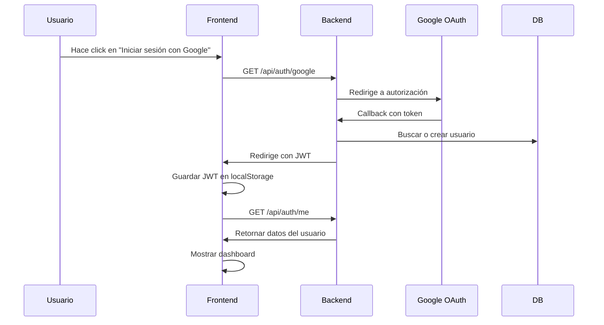
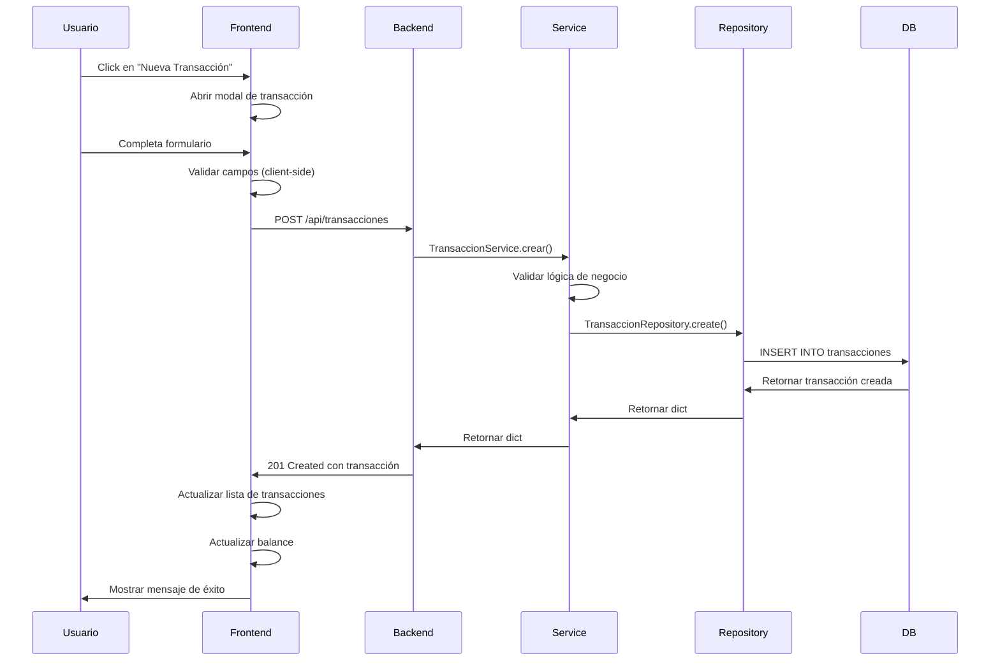
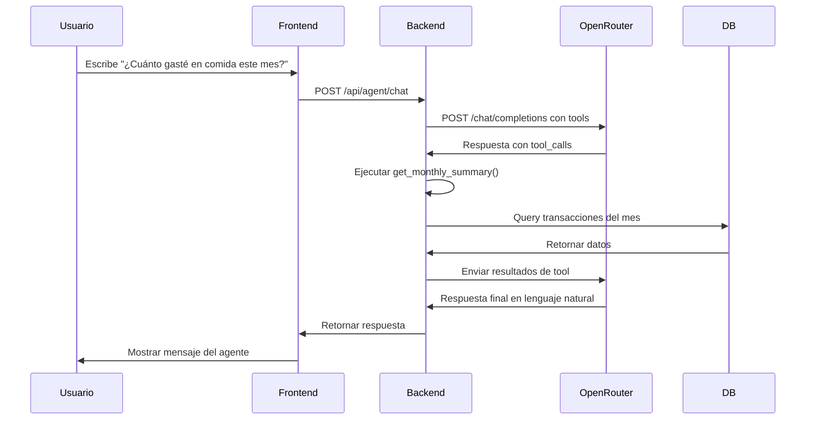

# PRD - Sistema de Gastos Inteligente

> **Product Requirements Document v1.0**  
> **Fecha**: 2026-02-04  
> **Propósito**: Especificación completa para testing y desarrollo

---

## 📋 Tabla de Contenidos

1. [Visión General](#-visión-general)
2. [Objetivos del Producto](#-objetivos-del-producto)
3. [Stack Tecnológico](#-stack-tecnológico)
4. [Arquitectura del Sistema](#-arquitectura-del-sistema)
5. [Modelos de Datos](#-modelos-de-datos)
6. [Funcionalidades Core](#-funcionalidades-core)
7. [Flujos de Usuario](#-flujos-de-usuario)
8. [APIs y Endpoints](#-apis-y-endpoints)
9. [Reglas de Negocio](#-reglas-de-negocio)
10. [Requerimientos No Funcionales](#-requerimientos-no-funcionales)
11. [Criterios de Aceptación](#-criterios-de-aceptación)

---

## 🎯 Visión General

**Sistema de Gastos Inteligente** es una plataforma full-stack de gestión financiera personal que combina:
- ✅ Gestión de transacciones multi-moneda (ARS, USD, EUR, BRL)
- ✅ Objetivos de ahorro con tracking visual
- ✅ Gestión de deudas de tarjetas de crédito
- ✅ Agente IA conversacional con function calling
- ✅ Dashboard personalizable con widgets interactivos
- ✅ Multi-tenancy (cada usuario tiene sus propios datos)

### Problema que Resuelve

- ❌ Apps financieras genéricas sin personalización
- ❌ Falta de visibilidad sobre gastos recurrentes
- ❌ Sin análisis predictivo ni agente IA
- ❌ Interfaces complejas y poco intuitivas

### Solución Propuesta

- ✅ Dashboard moderno con glass-morphism
- ✅ Agente IA que responde preguntas y ejecuta acciones
- ✅ Tracking de tarjetas de crédito y pagos pendientes
- ✅ Objetivos de ahorro con progreso visual
- ✅ Multi-moneda con cotizaciones en tiempo real

---

## 🎯 Objetivos del Producto

### Objetivos de Negocio
1. **Simplificar la gestión financiera personal** para usuarios no expertos
2. **Ofrecer insights automáticos** mediante IA conversacional
3. **Reducir el tiempo de entrada de datos** con bulk uploads y OCR (planeado)
4. **Aumentar la retención** con gamificación de objetivos de ahorro

### Objetivos de Usuario
1. **Consultar balance** en menos de 3 segundos
2. **Registrar un gasto** en menos de 30 segundos
3. **Ver progreso de objetivos** en tiempo real
4. **Chatear con el agente IA** para análisis de gastos

---

## 🛠️ Stack Tecnológico

### Frontend
```
React 19              # Framework UI (sin import React)
Vite 5.x              # Build tool
Tailwind CSS 3.4      # Styling utility-first
shadcn/ui             # Sistema de componentes
Recharts 2.x          # Visualización de datos
Lucide React          # Iconos
React Router DOM 6.x  # Routing
Context API           # Estado global
```

**Puerto**: 3000 (desarrollo)

### Backend
```
FastAPI 0.104+        # Framework async
Python 3.11+          # Lenguaje
SQLAlchemy 2.x        # ORM
Pydantic v2           # Validación de datos
PostgreSQL 16         # Base de datos
Uvicorn               # ASGI server
HTTPX                 # Cliente HTTP async
```

**Puerto**: 8000

### Servicios Externos
```
OpenRouter API        # LLMs (Claude, GPT, Gemini)
Yahoo Finance API     # Cotizaciones de CEDEARs
Dólar API Argentina   # Tipos de cambio
MinIO                 # Almacenamiento S3-compatible
Google OAuth          # Autenticación (planeado)
```

### Infraestructura
```
Docker Swarm          # Orquestación
Traefik               # Reverse proxy + SSL
Let's Encrypt         # Certificados SSL
DuckDNS               # DNS dinámico
```

---

## 🏗️ Arquitectura del Sistema

### Patrón de Capas

```
┌─────────────────────────────────────────────────────────┐
│                    Frontend (React)                      │
│  Componentes → Contexts → Hooks → Services (API calls)  │
└────────────────┬────────────────────────────────────────┘
                 │ HTTP/REST
                 ↓
┌─────────────────────────────────────────────────────────┐
│                 Backend (FastAPI)                        │
│  Routers → Services → Repositories → Database           │
└────────────────┬────────────────────────────────────────┘
                 │ SQL
                 ↓
┌─────────────────────────────────────────────────────────┐
│                PostgreSQL Database                       │
│  Tables: usuarios, transacciones, categorias, etc.      │
└─────────────────────────────────────────────────────────┘
```

### Separation of Concerns (Agentes)

| Agente | Responsabilidad | Ubicación |
|--------|-----------------|-----------|
| **Frontend Agent** | UI/UX, componentes React, estilos | `frontend/src/` |
| **Backend Agent** | Lógica de negocio, servicios, repositorios | `backend/app/services/`, `backend/app/repositories/` |
| **API Agent** | Endpoints HTTP, schemas Pydantic | `backend/app/routers/`, `backend/app/schemas/` |
| **Database Agent** | Modelos SQLAlchemy, migraciones | `backend/app/models/db_models.py`, `backend/alembic/` |
| **AI Agent** | Tools del agente IA, NLP | `backend/app/services/agent_tools.py` |

---

## 💾 Modelos de Datos

### 1. Usuario (Multi-tenancy)

```sql
usuarios (
  id: UUID PRIMARY KEY,
  email: VARCHAR(255) UNIQUE NOT NULL,
  full_name: VARCHAR(255) NOT NULL,
  active: BOOLEAN DEFAULT TRUE,
  moneda_preferida: VARCHAR(3) DEFAULT 'ARS',
  timezone: VARCHAR(50),
  avatar_url: TEXT,
  configuracion_notificaciones: JSONB,
  tema_preferido: VARCHAR(20) DEFAULT 'claro',
  fecha_creacion: TIMESTAMP,
  fecha_actualizacion: TIMESTAMP,
  ultimo_login: TIMESTAMP,
  picture: TEXT
)
```

**Relaciones**:
- `1:N` con `transacciones`
- `1:N` con `pagos_pendientes`
- `1:N` con `resumenes_bancarios`
- `1:N` con `categorias`
- `1:N` con `metodos_pago`
- `1:N` con `objetivos_ahorro`

### 2. Transacción

```sql
transacciones (
  id: UUID PRIMARY KEY,
  monto: NUMERIC(15,2),
  moneda: VARCHAR(3) DEFAULT 'ARS',
  monto_ars: NUMERIC(15,2) NOT NULL,
  tasa_cambio: NUMERIC(10,4) DEFAULT 1.0,
  descripcion: TEXT,
  fecha_transaccion: DATE NOT NULL,
  tipo: VARCHAR(20) CHECK (tipo IN ('ingreso', 'gasto')),
  notas: TEXT,
  archivo_adjunto: TEXT,
  comprobante: TEXT,
  
  -- Tarjetas de crédito
  es_credito: BOOLEAN DEFAULT FALSE,
  fecha_pago_real: DATE,
  resumen_tarjeta_id: UUID,
  
  -- Objetivos de ahorro
  es_aporte_objetivo: BOOLEAN DEFAULT TRUE,
  
  -- Foreign Keys
  categoria_id: UUID REFERENCES categorias(id),
  metodo_pago_id: UUID REFERENCES metodos_pago(id),
  usuario_id: UUID REFERENCES usuarios(id) ON DELETE CASCADE,
  objetivo_id: UUID REFERENCES objetivos_ahorro(id),
  
  fecha_creacion: TIMESTAMP,
  fecha_actualizacion: TIMESTAMP
)
```

**Índices**:
```sql
CREATE INDEX idx_transacciones_usuario_fecha ON transacciones(usuario_id, fecha_transaccion);
CREATE INDEX idx_transacciones_mes_anio ON transacciones(EXTRACT(year FROM fecha_transaccion), EXTRACT(month FROM fecha_transaccion));
CREATE INDEX idx_transacciones_tipo ON transacciones(tipo);
```

### 3. Categoría

```sql
categorias (
  id: UUID PRIMARY KEY,
  nombre: VARCHAR(100) NOT NULL,
  tipo: VARCHAR(20) CHECK (tipo IN ('ingreso', 'gasto')),
  color: VARCHAR(7),  -- HEX color
  icono: VARCHAR(50),  -- Lucide icon name
  activa: BOOLEAN DEFAULT TRUE,
  descripcion: TEXT,
  usuario_id: UUID REFERENCES usuarios(id) ON DELETE CASCADE,
  fecha_creacion: TIMESTAMP,
  fecha_actualizacion: TIMESTAMP
)
```

**Categorías Predeterminadas**:
- **Gastos**: Alimentos, Transporte, Salud, Educación, Entretenimiento, Servicios, Otros
- **Ingresos**: Salario, Freelance, Inversiones, Otros

### 4. Método de Pago

```sql
metodos_pago (
  id: UUID PRIMARY KEY,
  nombre: VARCHAR(100) NOT NULL,
  tipo: VARCHAR(50),  -- efectivo, debito, credito, transferencia
  activo: BOOLEAN DEFAULT TRUE,
  color: VARCHAR(7),
  icono: VARCHAR(50),
  descripcion: TEXT,
  usuario_id: UUID REFERENCES usuarios(id) ON DELETE CASCADE,
  fecha_creacion: TIMESTAMP
)
```

### 5. Objetivo de Ahorro

```sql
objetivos_ahorro (
  id: UUID PRIMARY KEY,
  nombre: VARCHAR(255) NOT NULL,
  monto_objetivo: NUMERIC(15,2) NOT NULL,
  monto_actual: NUMERIC(15,2) DEFAULT 0,
  moneda: VARCHAR(3) DEFAULT 'ARS',
  fecha_inicio: DATE,
  fecha_limite: DATE,
  estado: VARCHAR(20) DEFAULT 'en_progreso',
  descripcion: TEXT,
  icono: VARCHAR(50),
  color: VARCHAR(7),
  activo: BOOLEAN DEFAULT TRUE,
  usuario_id: UUID REFERENCES usuarios(id) ON DELETE CASCADE,
  fecha_creacion: TIMESTAMP,
  fecha_actualizacion: TIMESTAMP
)
```

**Estados**: `en_progreso`, `completado`, `pausado`, `cancelado`

### 6. Pago Pendiente

```sql
pagospendientes (
  id: UUID PRIMARY KEY,
  nombre: TEXT,
  descripcion: TEXT,
  monto: NUMERIC,
  moneda: VARCHAR(50),
  fechavencimiento: DATE,
  fechacreacion: TIMESTAMP,
  fechaactualizacion: TIMESTAMP,
  prioridad: VARCHAR(50),  -- alta, media, baja
  tipo: VARCHAR(50),
  proximovencimiento: DATE,
  notas: TEXT,
  interes: NUMERIC,
  recargo: NUMERIC,
  fecha_emision: TEXT,
  liquidacion: TEXT,
  periodo: TEXT,
  deuda_registrada: JSON,
  url_pdf: TEXT,
  num_factura: TEXT,
  incluirencuotaalimentaria: BOOLEAN,
  gastocompartido: BOOLEAN,
  estado: VARCHAR(50) DEFAULT 'pendiente',
  fechapago: DATE,
  
  -- Foreign Keys
  usuario_id: UUID REFERENCES usuarios(id) ON DELETE CASCADE,
  categoria_id: UUID REFERENCES categorias(id),
  metodo_pago_id: UUID REFERENCES metodos_pago(id)
)
```

### 7. Resumen Bancario (Tarjetas de Crédito)

```sql
resumenes_bancarios (
  id: UUID PRIMARY KEY,
  banco: VARCHAR(255),
  tipo_tarjeta: VARCHAR(50),  -- Visa, Mastercard, Amex
  numero_resumen: VARCHAR(100),
  fecha_emision: DATE,
  fecha_vencimiento: DATE,
  totales: JSONB,  -- {saldo_actual_pesos, saldo_actual_dolares, pago_minimo_pesos, etc.}
  pagado: BOOLEAN DEFAULT FALSE,
  pagado_ars: BOOLEAN DEFAULT FALSE,
  pagado_usd: BOOLEAN DEFAULT FALSE,
  url_pdf: TEXT,
  usuario_id: UUID REFERENCES usuarios(id) ON DELETE CASCADE,
  fecha_creacion: TIMESTAMP,
  fecha_actualizacion: TIMESTAMP
)
```

### 8. Presupuesto

```sql
presupuestos (
  id: UUID PRIMARY KEY,
  nombre: VARCHAR(255) NOT NULL,
  monto_limite: NUMERIC(15,2) NOT NULL,
  monto_gastado: NUMERIC(15,2) DEFAULT 0,
  moneda: VARCHAR(3) DEFAULT 'ARS',
  periodo: VARCHAR(20),  -- mensual, anual
  fecha_inicio: DATE,
  fecha_fin: DATE,
  categoria_id: UUID REFERENCES categorias(id),
  usuario_id: UUID REFERENCES usuarios(id) ON DELETE CASCADE,
  activo: BOOLEAN DEFAULT TRUE,
  fecha_creacion: TIMESTAMP,
  fecha_actualizacion: TIMESTAMP
)
```

### 9. AI Activity (Logging del Agente)

```sql
ai_activity (
  id: UUID PRIMARY KEY,
  user_query: TEXT,
  model: VARCHAR(255),
  tokens_prompt: INTEGER,
  tokens_completion: INTEGER,
  cost_usd: NUMERIC(10,6),
  response_time_ms: INTEGER,
  tools_used: JSONB,
  usuario_id: UUID REFERENCES usuarios(id),
  created_at: TIMESTAMP
)
```

---

## ⚙️ Funcionalidades Core

### 1. Dashboard (Mission Control)

**Ubicación**: `frontend/src/components/MissionControlDashboard.jsx`

**Descripción**: Vista principal con widgets personalizables

**Widgets Disponibles**:
- ✅ Stats Cards (Balance, Ingresos, Gastos)
- ✅ Transacciones Recientes
- ✅ Categorías (Top gastos por categoría)
- ✅ Métodos de Pago
- ✅ Objetivos de Ahorro
- ✅ Deuda de Tarjetas
- ✅ Pagos Pendientes
- ✅ Cotizaciones de Dólar
- ✅ AI Usage (tokens consumidos)

**Características**:
- Grid responsive (1 columna mobile, 2-4 desktop)
- Glass-morphism estándar
- Animaciones fade-in
- Lazy loading de widgets
- Refresh manual y automático

**Criterios de Aceptación**:
```gherkin
Scenario: Usuario visualiza el dashboard
  Given el usuario está autenticado
  When accede a la ruta "/"
  Then debe ver el dashboard con todos los widgets
  And el balance debe mostrarse en la moneda preferida
  And los widgets deben cargarse en menos de 3 segundos
```

### 2. Gestión de Transacciones

**Ubicación**: 
- Frontend: `frontend/src/components/ModernTransactionForm.jsx`
- Backend: `backend/app/routers/transacciones.py`
- Repository: `backend/app/repositories/transaccion_repository.py`

**Funcionalidades**:

#### 2.1 Crear Transacción
- **Campos**:
  - Descripción (requerido, max 500 chars)
  - Monto (requerido, > 0)
  - Tipo (requerido, `ingreso` | `gasto`)
  - Moneda (requerido, `ARS` | `USD` | `EUR` | `BRL`)
  - Categoría (opcional, selección)
  - Método de Pago (opcional, selección)
  - Fecha (requerido, default: hoy)
  - Es crédito (checkbox, default: false)
  - Objetivo asociado (opcional, selección)
  - Notas (opcional, textarea)
  - Comprobante (opcional, file upload)

- **Validaciones**:
  - Monto debe ser positivo
  - Descripción no vacía
  - Tipo debe ser `ingreso` o `gasto`
  - Si `es_credito = true`, no puede asociarse a un objetivo

- **Conversión de Moneda**:
  - Si moneda != ARS, calcular `monto_ars` automáticamente
  - Obtener `tasa_cambio` de APIs externas
  - Guardar ambos valores (`monto` original y `monto_ars`)

**Criterios de Aceptación**:
```gherkin
Scenario: Usuario crea un gasto en dólares
  Given el usuario abre el formulario de transacción
  When selecciona tipo "gasto"
  And ingresa monto "100" USD
  And selecciona categoría "Supermercado"
  And hace click en "Guardar"
  Then debe crearse la transacción
  And monto_ars debe calcularse automáticamente
  And debe aparecer en la lista de transacciones recientes
  And el balance debe actualizarse
```

#### 2.2 Editar Transacción
- Mismo formulario que crear, pero prellenado
- Debe actualizar `fecha_actualizacion`
- Si cambia moneda o monto, recalcular `monto_ars`

#### 2.3 Eliminar Transacción
- Confirmación con AlertDialog
- Si está asociada a un objetivo, restar del `monto_actual`
- Soft delete o hard delete (configurar)

#### 2.4 Filtrar Transacciones
- **Filtros disponibles**:
  - Rango de fechas
  - Tipo (ingreso, gasto, ambos)
  - Moneda
  - Categoría
  - Método de pago
  - Búsqueda de texto en descripción

#### 2.5 Exportar Transacciones
- Formatos: CSV, Excel, PDF
- Incluir filtros aplicados
- Generación async si > 1000 registros

### 3. Gestión de Categorías

**Ubicación**:
- Frontend: `frontend/src/components/mission-control/modals/CategoryModal.jsx`
- Backend: `backend/app/routers/categories.py`
- Repository: `backend/app/repositories/categoria_repository.py`

**Funcionalidades**:

#### 3.1 CRUD de Categorías
- **Crear**:
  - Nombre (requerido, unique por usuario)
  - Tipo (`ingreso` | `gasto`)
  - Color (HEX, opcional)
  - Icono (Lucide icon name, opcional)
  - Descripción (opcional)

- **Editar**: Mismo formulario

- **Eliminar**:
  - Soft delete (`activa = false`)
  - Validar que no tenga transacciones asociadas activas

- **Activar/Desactivar**: Toggle del campo `activa`

#### 3.2 Vista de Categorías
- **Lista**: Todas las categorías del usuario
- **Stats**: Total gastado por categoría (último mes)
- **Gráfico**: PieChart con distribución de gastos

**Criterios de Aceptación**:
```gherkin
Scenario: Usuario crea una categoría
  Given el usuario abre el modal de categorías
  When hace click en "Nueva Categoría"
  And ingresa nombre "Gimnasio"
  And selecciona tipo "gasto"
  And selecciona color "#3b82f6"
  And hace click en "Guardar"
  Then debe crearse la categoría
  And debe aparecer en la lista de categorías
  And debe estar disponible en el formulario de transacciones
```

### 4. Gestión de Métodos de Pago

**Ubicación**:
- Frontend: `frontend/src/components/mission-control/modals/PaymentMethodModal.jsx`
- Backend: `backend/app/routers/payment_methods.py`
- Repository: `backend/app/repositories/metodo_pago_repository.py`

**Funcionalidades**:
- CRUD completo (igual que categorías)
- Tipos: `efectivo`, `debito`, `credito`, `transferencia`, `otro`
- Vista con stats de uso por método

### 5. Objetivos de Ahorro

**Ubicación**:
- Frontend: `frontend/src/components/mission-control/ObjetivosWidget.jsx`
- Backend: `backend/app/routers/objetivos.py`
- Repository: `backend/app/repositories/objetivo_ahorro_repository.py`

**Funcionalidades**:

#### 5.1 Crear Objetivo
- **Campos**:
  - Nombre (requerido)
  - Monto objetivo (requerido, > 0)
  - Moneda (default: moneda preferida del usuario)
  - Fecha límite (opcional)
  - Descripción (opcional)
  - Icono (opcional)
  - Color (opcional)

#### 5.2 Aportar a Objetivo
- **Método 1**: Al crear una transacción tipo `ingreso`, asociarla al objetivo
- **Método 2**: Botón "Aportar" en el widget del objetivo
- Actualiza `monto_actual` automáticamente

#### 5.3 Visualización
- **Progress Bar**: `(monto_actual / monto_objetivo) * 100`
- **Gráfico**: LineChart de evolución temporal
- **Estado**: Cambia a `completado` cuando `monto_actual >= monto_objetivo`

**Criterios de Aceptación**:
```gherkin
Scenario: Usuario crea un objetivo y aporta
  Given el usuario crea un objetivo "Vacaciones" de $50,000 ARS
  When crea una transacción de ingreso de $10,000 ARS
  And asocia la transacción al objetivo "Vacaciones"
  Then el objetivo debe mostrar progreso del 20%
  And monto_actual debe ser $10,000
```

### 6. Gestión de Tarjetas de Crédito

**Ubicación**:
- Frontend: `frontend/src/components/mission-control/DeudaTarjetasWidget.jsx`
- Backend: `backend/app/routers/resumenes_bancarios.py`
- Repository: `backend/app/repositories/resumen_bancario_repository.py`

**Funcionalidades**:

#### 6.1 Crear Resumen Bancario
- **Campos**:
  - Banco (requerido)
  - Tipo de tarjeta (Visa, Mastercard, Amex)
  - Número de resumen (único)
  - Fecha de emisión
  - Fecha de vencimiento
  - Totales (JSONB):
    - `saldo_actual_pesos`
    - `saldo_actual_dolares`
    - `pago_minimo_pesos`
    - `pago_minimo_dolares`
  - URL del PDF (opcional)

#### 6.2 Asociar Gastos al Resumen
- Al crear transacción con `es_credito = true`, asociar a resumen pendiente
- `resumen_tarjeta_id` se llena automáticamente

#### 6.3 Pagar Resumen
- **Acción**: Botón "Pagar" en el widget
- **Efecto**:
  - Marcar `pagado = true`
  - Crear transacción tipo `gasto` con el monto total
  - Actualizar `fecha_pago_real` en todas las transacciones asociadas

**Criterios de Aceptación**:
```gherkin
Scenario: Usuario paga un resumen de tarjeta
  Given el usuario tiene un resumen con saldo de $30,000 ARS
  And tiene 5 transacciones asociadas al resumen
  When hace click en "Pagar Resumen"
  And confirma el pago
  Then debe crearse una transacción de $30,000 ARS tipo "gasto"
  And las 5 transacciones deben actualizarse con fecha_pago_real
  And el resumen debe marcarse como pagado
  And el balance debe disminuir en $30,000
```

### 7. Pagos Pendientes

**Ubicación**:
- Frontend: `frontend/src/components/mission-control/new-design/PendingPaymentsSection.jsx`
- Backend: `backend/app/routers/pagos_pendientes.py`
- Repository: `backend/app/repositories/pago_pendiente_repository_pg.py`

**Funcionalidades**:
- CRUD de pagos pendientes
- Filtros: vencidos, próximos a vencer, pagados
- Notificaciones (planeado)
- Marcar como pagado → crea transacción automáticamente

### 8. Agente IA Financiero

**Ubicación**:
- Frontend: `frontend/src/components/FinancialAgentChat.jsx`
- Backend: `backend/app/routers/agent.py`
- Tools: `backend/app/services/agent_tools.py`

**Descripción**: Agente conversacional con function calling para consultas y acciones financieras

**Tools Disponibles**:

| Tool | Descripción | Parámetros |
|------|-------------|------------|
| `get_transactions` | Obtiene transacciones filtradas | `tipo`, `moneda`, `limit` |
| `create_transaction` | Crea nueva transacción | `descripcion`, `monto`, `tipo`, `moneda`, `categoria`, `metodo_pago`, `fecha` |
| `get_balance` | Obtiene balance actual | `moneda` |
| `get_monthly_summary` | Resumen mensual de gastos | `month`, `year` |
| `get_credit_card_expenses` | Gastos de tarjeta pendientes | - |
| `search_transactions` | Busca transacciones | `query`, `date_from`, `date_to` |

**Flujo de Function Calling**:
1. Usuario envía mensaje al agente
2. Backend envía request a OpenRouter con tools disponibles
3. Modelo decide si usa tools o responde directamente
4. Si usa tools:
   - Parsear `tool_calls` del response
   - Ejecutar cada tool con `execute_tool(tool_name, params, db)`
   - Enviar resultados de vuelta al modelo
   - Obtener respuesta final del modelo
5. Retornar respuesta al frontend

**Criterios de Aceptación**:
```gherkin
Scenario: Usuario consulta balance con el agente
  Given el usuario abre el chat del agente
  When escribe "¿Cuánto tengo en mi cuenta en dólares?"
  Then el agente debe usar la tool get_balance con moneda="USD"
  And debe responder con el balance actual en USD
  And la respuesta debe ser en lenguaje natural
```

### 9. Cotizaciones y Mercado

**Ubicación**:
- Frontend: `frontend/src/components/DollarQuoteWidget.jsx`, `frontend/src/components/CedearsView.jsx`
- Backend: `backend/app/routers/yfinance_router.py`
- Service: `frontend/src/services/yfinanceService.js`

**Funcionalidades**:
- Cotizaciones de dólar (oficial, blue, MEP, CCL)
- Tracking de CEDEARs (acciones argentinas en BYMA)
- Conversión de monedas en tiempo real

### 10. Bulk Upload de Transacciones

**Ubicación**:
- Frontend: `frontend/src/components/BulkTransactionUpload.jsx`
- Backend: `backend/app/routers/transacciones.py`

**Funcionalidades**:
- Subir CSV con transacciones
- Validación de formato
- Preview antes de importar
- Manejo de errores por fila

---

## 🔄 Flujos de Usuario

### Flujo 1: Registro y Onboarding (Planeado)



### Flujo 2: Crear Transacción



### Flujo 3: Chatear con el Agente IA



---

## 🔌 APIs y Endpoints

### Autenticación

```
GET    /api/auth/google           # Iniciar OAuth2 con Google
GET    /api/auth/google/callback  # Callback de Google
GET    /api/auth/me               # Obtener usuario actual
POST   /api/auth/logout           # Cerrar sesión
```

### Transacciones

```
GET    /api/transacciones                    # Listar transacciones (con filtros)
GET    /api/transacciones/{id}               # Obtener por ID
POST   /api/transacciones                    # Crear transacción
PUT    /api/transacciones/{id}               # Actualizar transacción
DELETE /api/transacciones/{id}               # Eliminar transacción
GET    /api/transacciones/stats/balance     # Balance por moneda
GET    /api/transacciones/stats/monthly     # Resumen mensual
POST   /api/transacciones/bulk              # Importar CSV
GET    /api/transacciones/export            # Exportar a CSV/Excel
```

### Categorías

```
GET    /api/categorias            # Listar categorías del usuario
GET    /api/categorias/{id}       # Obtener por ID
POST   /api/categorias            # Crear categoría
PUT    /api/categorias/{id}       # Actualizar categoría
DELETE /api/categorias/{id}       # Eliminar (soft delete)
PATCH  /api/categorias/{id}/toggle-active  # Activar/desactivar
```

### Métodos de Pago

```
GET    /api/metodos-pago          # Listar métodos
GET    /api/metodos-pago/{id}     # Obtener por ID
POST   /api/metodos-pago          # Crear método
PUT    /api/metodos-pago/{id}     # Actualizar método
DELETE /api/metodos-pago/{id}     # Eliminar
```

### Objetivos de Ahorro

```
GET    /api/objetivos             # Listar objetivos del usuario
GET    /api/objetivos/{id}        # Obtener por ID
POST   /api/objetivos             # Crear objetivo
PUT    /api/objetivos/{id}        # Actualizar objetivo
DELETE /api/objetivos/{id}        # Eliminar objetivo
POST   /api/objetivos/{id}/aporte # Aportar al objetivo
GET    /api/objetivos/{id}/historial  # Historial de aportes
```

### Pagos Pendientes

```
GET    /api/pagos-pendientes                 # Listar pagos
GET    /api/pagos-pendientes/{id}            # Obtener por ID
POST   /api/pagos-pendientes                 # Crear pago
PATCH  /api/pagos-pendientes/{id}            # Actualizar pago
DELETE /api/pagos-pendientes/{id}            # Eliminar pago
POST   /api/pagos-pendientes/{id}/mark-paid  # Marcar como pagado
GET    /api/pagos-pendientes/vencidos        # Pagos vencidos
GET    /api/pagos-pendientes/proximos-vencer # Próximos a vencer
```

### Resúmenes Bancarios

```
GET    /api/resumenes-bancarios              # Listar resúmenes
GET    /api/resumenes-bancarios/{id}         # Obtener por ID
POST   /api/resumenes-bancarios              # Crear resumen
PUT    /api/resumenes-bancarios/{id}         # Actualizar resumen
DELETE /api/resumenes-bancarios/{id}         # Eliminar resumen
POST   /api/resumenes-bancarios/{id}/pagar   # Pagar resumen
```

### Presupuestos

```
GET    /api/presupuestos          # Listar presupuestos
GET    /api/presupuestos/{id}     # Obtener por ID
POST   /api/presupuestos          # Crear presupuesto
PUT    /api/presupuestos/{id}     # Actualizar presupuesto
DELETE /api/presupuestos/{id}     # Eliminar presupuesto
GET    /api/presupuestos/{id}/progreso  # Progreso del presupuesto
```

### Agente IA

```
POST   /api/agent/chat            # Chatear con el agente
GET    /api/agent/history         # Historial de conversaciones
DELETE /api/agent/history         # Limpiar historial
```

### Archivos

```
POST   /api/files/upload          # Subir comprobante (MinIO)
GET    /api/files/{id}            # Descargar archivo
DELETE /api/files/{id}            # Eliminar archivo
```

### Cotizaciones

```
GET    /api/quotes/dollar         # Cotizaciones de dólar
GET    /api/quotes/cedears        # Cotizaciones de CEDEARs
GET    /api/quotes/crypto         # Cotizaciones de cripto (planeado)
```

---

## 📜 Reglas de Negocio

### 1. Multi-tenancy
- ✅ Cada usuario solo puede ver sus propios datos
- ✅ Todas las queries deben filtrar por `usuario_id`
- ✅ Las categorías y métodos de pago son por usuario

### 2. Conversión de Monedas
- ✅ Toda transacción debe tener `monto_ars` calculado
- ✅ Si moneda = ARS, `monto_ars = monto`
- ✅ Si moneda != ARS, obtener `tasa_cambio` de API externa
- ✅ `monto_ars = monto * tasa_cambio`

### 3. Balance
- ✅ Balance = SUM(ingresos) - SUM(gastos)
- ✅ Excluir transacciones con `es_credito = true` del balance
- ✅ Balance por moneda (ARS, USD, EUR, BRL)

### 4. Tarjetas de Crédito
- ✅ Si `es_credito = true`, NO impacta en balance hasta pagar resumen
- ✅ Al pagar resumen, crear transacción tipo `gasto` por el total
- ✅ Actualizar `fecha_pago_real` en todas las transacciones del resumen

### 5. Objetivos de Ahorro
- ✅ Solo transacciones tipo `ingreso` pueden asociarse a objetivos
- ✅ `monto_actual` se actualiza automáticamente al crear/eliminar transacciones
- ✅ Estado cambia a `completado` cuando `monto_actual >= monto_objetivo`

### 6. Validaciones
- ✅ Monto siempre debe ser > 0
- ✅ Tipo debe ser `ingreso` o `gasto`
- ✅ Categoría y método de pago deben pertenecer al usuario
- ✅ Fecha de transacción no puede ser futura (configurable)

### 7. Agente IA
- ✅ Solo puede acceder a datos del usuario actual
- ✅ No puede eliminar datos sin confirmación explícita
- ✅ Debe registrar todas las acciones en `ai_activity`

---

## 🚀 Requerimientos No Funcionales

### Performance
- ✅ Dashboard debe cargar en < 3 segundos
- ✅ Queries de transacciones con < 500ms (con índices)
- ✅ Agente IA debe responder en < 10 segundos

### Escalabilidad
- ✅ Soportar 10,000 transacciones por usuario sin degradación
- ✅ Soportar 1,000 usuarios concurrentes

### Disponibilidad
- ✅ 99.5% uptime (permitir 3.6 horas de downtime por mes)
- ✅ Health checks cada 30 segundos

### Seguridad
- ✅ Autenticación con OAuth2
- ✅ JWT para sesiones
- ✅ HTTPS obligatorio en producción
- ✅ Rate limiting (100 req/min por IP)
- ✅ SQL injection prevention (ORM)

### Usabilidad
- ✅ Responsive design (mobile-first)
- ✅ Accesibilidad WCAG 2.1 AA (planeado)
- ✅ Mensajes de error claros
- ✅ Loading states en todas las operaciones async

---

## ✅ Criterios de Aceptación

### Criterios Generales
1. **Autenticación**: Usuario puede iniciar sesión y ver su dashboard
2. **Dashboard**: Muestra balance, transacciones recientes, y widgets
3. **Transacciones**: Usuario puede crear, editar, eliminar transacciones
4. **Filtros**: Filtros de transacciones funcionan correctamente
5. **Multi-moneda**: Conversión automática a ARS funciona
6. **Categorías**: Usuario puede gestionar sus categorías
7. **Objetivos**: Usuario puede crear y aportar a objetivos
8. **Tarjetas**: Usuario puede gestionar resúmenes de tarjetas
9. **Agente IA**: Agente responde preguntas y ejecuta acciones
10. **Responsive**: App funciona en mobile, tablet, y desktop

### Matriz de Pruebas (Testing Matrix)

| Módulo | Pruebas Unitarias | Pruebas de Integración | Pruebas E2E |
|--------|-------------------|------------------------|-------------|
| **Backend - Repositories** | ✅ CRUD operations | ✅ DB queries | - |
| **Backend - Services** | ✅ Business logic | ✅ Repository integration | - |
| **Backend - Routers** | ✅ Schema validation | ✅ Full endpoint flow | ✅ API calls |
| **Frontend - Components** | ✅ Rendering | ✅ API integration | ✅ User flows |
| **Frontend - Forms** | ✅ Validation | ✅ Submission | ✅ E2E creation |
| **Agente IA** | ✅ Tool execution | ✅ OpenRouter integration | ✅ Conversational flow |

---

## 📝 Casos de Uso para Testing

### UC-001: Registro de Usuario
**Actor**: Usuario nuevo  
**Flujo**:
1. Usuario hace click en "Iniciar sesión con Google"
2. Sistema redirige a Google OAuth
3. Usuario autoriza la app
4. Sistema crea usuario si no existe
5. Sistema retorna a dashboard

**Resultado Esperado**: Usuario ve el dashboard con datos iniciales

---

### UC-002: Crear Transacción de Gasto
**Actor**: Usuario autenticado  
**Flujo**:
1. Usuario click en "Nueva Transacción"
2. Usuario completa formulario (gasto, $500 ARS, Supermercado)
3. Usuario hace click en "Guardar"
4. Sistema valida datos
5. Sistema crea transacción
6. Sistema actualiza balance

**Resultado Esperado**: 
- Transacción visible en lista
- Balance disminuye en $500
- Mensaje de éxito mostrado

---

### UC-003: Consultar Balance con Agente IA
**Actor**: Usuario autenticado  
**Flujo**:
1. Usuario abre chat del agente
2. Usuario escribe "¿Cuánto tengo en ARS?"
3. Sistema envía query al agente
4. Agente usa tool `get_balance`
5. Agente responde con balance en ARS

**Resultado Esperado**: Respuesta del agente en lenguaje natural con balance correcto

---

### UC-004: Pagar Resumen de Tarjeta
**Actor**: Usuario autenticado  
**Flujo**:
1. Usuario ve widget de deuda de tarjetas
2. Usuario hace click en "Pagar" en resumen
3. Sistema muestra confirmación
4. Usuario confirma
5. Sistema crea transacción de gasto
6. Sistema actualiza transacciones asociadas
7. Sistema marca resumen como pagado

**Resultado Esperado**:
- Resumen marcado como pagado
- Transacción de pago creada
- Balance actualizado

---

### UC-005: Crear Objetivo y Aportar
**Actor**: Usuario autenticado  
**Flujo**:
1. Usuario crea objetivo "Vacaciones" ($50,000 ARS)
2. Usuario crea transacción de ingreso ($10,000 ARS)
3. Usuario asocia transacción al objetivo
4. Sistema actualiza `monto_actual` del objetivo

**Resultado Esperado**:
- Objetivo muestra progreso del 20%
- `monto_actual = $10,000`

---

## 🎯 Métricas de Éxito

### KPIs del Producto
- ✅ Tiempo promedio de creación de transacción: < 30 segundos
- ✅ Usuarios activos diarios: > 70% de usuarios registrados
- ✅ Satisfacción del usuario (NPS): > 8/10
- ✅ Tasa de retención a 30 días: > 50%

### KPIs Técnicos
- ✅ Disponibilidad: > 99.5%
- ✅ Tiempo de respuesta de API: < 500ms (p95)
- ✅ Tiempo de carga de dashboard: < 3 segundos
- ✅ Tasa de error de API: < 1%

---

## 📊 Cobertura de Testing Requerida

### Backend
- ✅ **Unit Tests**: > 80% de cobertura
  - Repositories: 100%
  - Services: 90%
  - Utils: 80%

- ✅ **Integration Tests**: > 70%
  - Endpoints completos
  - DB transactions
  - External APIs (mocked)

### Frontend
- ✅ **Component Tests**: > 60%
  - UI components
  - Forms
  - Hooks

- ✅ **E2E Tests**: Flujos críticos
  - Login
  - Crear transacción
  - Ver dashboard
  - Chatear con agente

---

## 🔮 Roadmap Futuro

### Versión 1.5 (Q2 2026)
- [ ] Google OAuth implementado
- [ ] Notificaciones push para vencimientos
- [ ] Exportación de reportes en PDF
- [ ] OCR para escaneo de facturas

### Versión 2.0 (Q4 2026)
- [ ] Machine Learning para predicción de gastos
- [ ] Integración con bancos (Open Banking)
- [ ] Modo offline con sync
- [ ] Mobile app (React Native)

---

## 📚 Referencias

- [README.md](./README.md) - Documentación general
- [AGENTS.md](./AGENTS.md) - Sistema de agentes y skills
- [Skills Directory](./skills/) - Skills de desarrollo
- [Frontend README](./frontend/README.md) - Documentación del frontend
- [Backend README](./backend/README.md) - Documentación del backend

---

**Versión**: 1.0  
**Autor**: Sistema de Gastos Team  
**Última Actualización**: 2026-02-04

