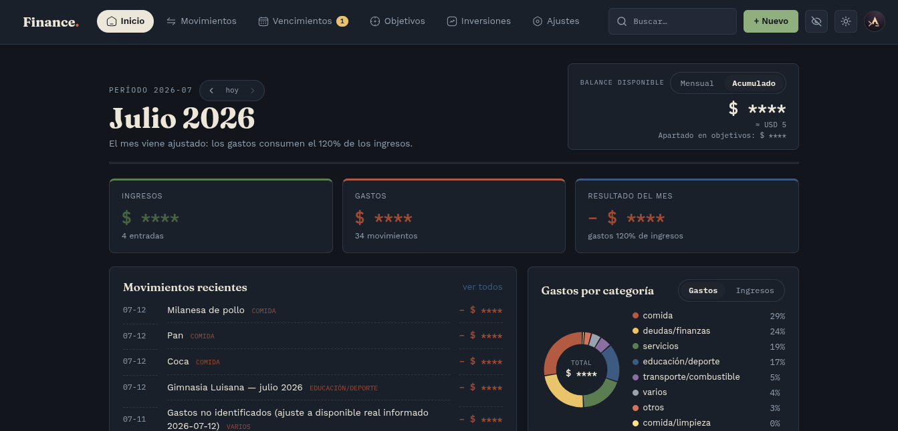
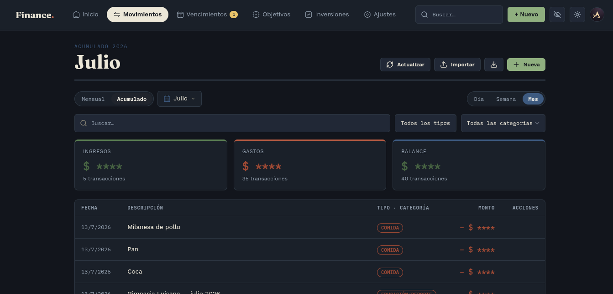
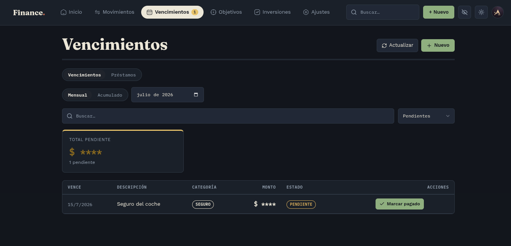
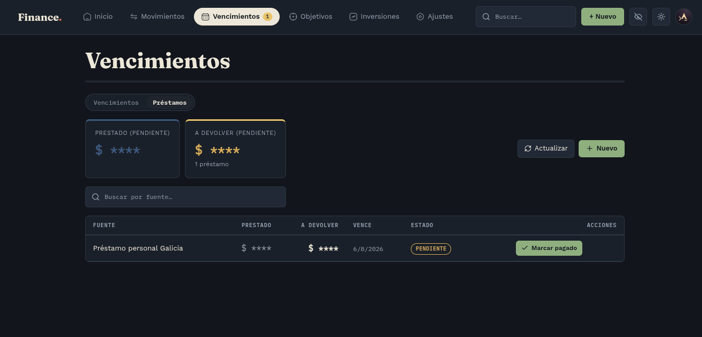
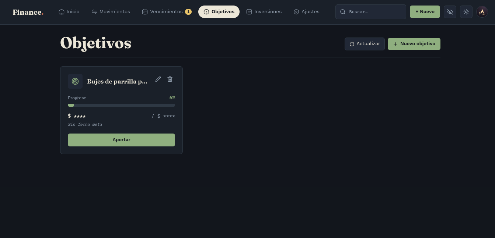
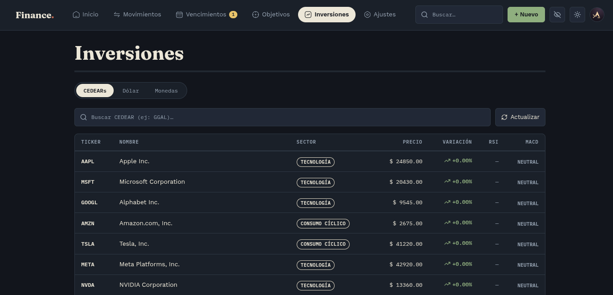
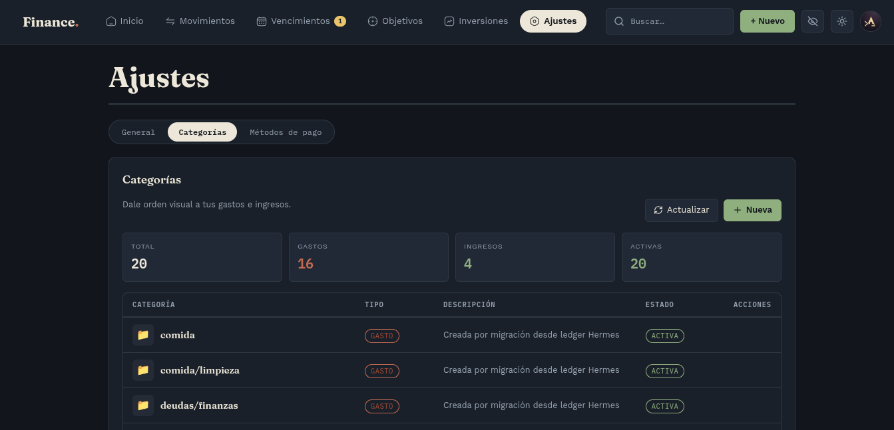
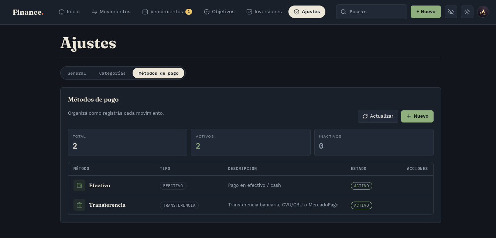

<div align="center">

# Sistema de Gastos Inteligente

Finanzas personales, un solo usuario, tema editorial "Papel"

</div>

---

## Arquitectura


```
Internet (HTTPS)
      │
   Traefik  (reverse proxy + TLS)
      │
      ├── Frontend — React 18 + Vite (Nginx)
      │        │
      │        └── llama a ↓
      │
      └── Backend — FastAPI + Uvicorn
               │
               ├── PostgreSQL 16 (SQLAlchemy)
               └── MinIO / S3 (comprobantes)
```

---

## Capturas

| Inicio | Movimientos |
|---|---|
|  |  |

| Vencimientos | Préstamos |
|---|---|
|  |  |

| Objetivos | Inversiones |
|---|---|
|  |  |

| Categorías | Métodos de pago |
|---|---|
|  |  |

---

## Instalación

### Requisitos

Node.js 18+, Python 3.11+, PostgreSQL 16, una cuenta MinIO (o S3-compatible), credenciales OAuth de Google.

### Backend

```bash
cd backend
python -m venv venv && source venv/bin/activate
pip install -r requirements.txt
uvicorn main:app --reload --port 8000
```

### Frontend

```bash
cd frontend
npm install
npm run dev   # http://localhost:5173
```

### Verificación

Login con Google (el email debe estar en `AUTHORIZED_EMAILS` y existir en la tabla `usuarios` con `active = true`) y confirmar que el dashboard carga datos.

---

## Variables de entorno

**`backend/.env`** (lista completa en `app/core/config.py`):

```env
SECRET_KEY=...
ACCESS_TOKEN_EXPIRE_MINUTES=1440
POSTGRES_HOST=...
POSTGRES_PORT=5432
POSTGRES_USER=postgres
POSTGRES_PASSWORD=...
POSTGRES_DB=sistema_financiero
GOOGLE_CLIENT_ID=...
GOOGLE_CLIENT_SECRET=...
AUTHORIZED_EMAILS=tu-email@ejemplo.com
SESSION_SECRET_KEY=...
DEV_FRONTEND_URL=http://localhost:3000
DEV_BACKEND_URL=http://localhost:8000
```

**`frontend/.env`**:

```env
VITE_API_URL=http://localhost:8000
```

---

## Documentación relacionada

- [`DESIGN.md`](./DESIGN.md) — tokens de diseño del tema Papel
- [`API_AGENTS.md`](./API_AGENTS.md) — guía de la API para agentes externos

---

<div align="center">

**Fernando Ariel Cassera** (fer336) — [GitHub](https://github.com/fer336) · fcassera@protonmail.com

</div>
