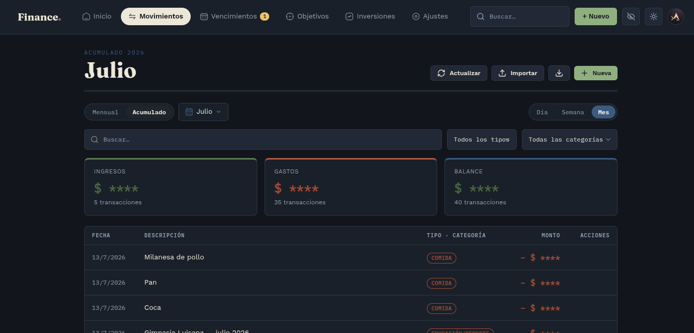
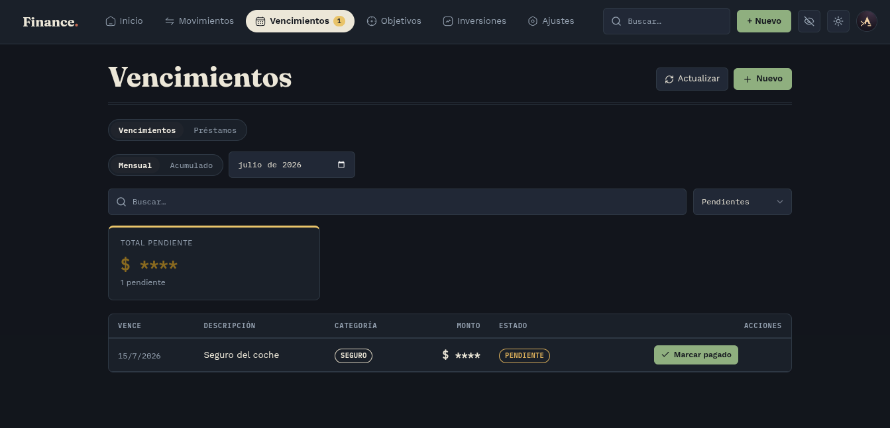
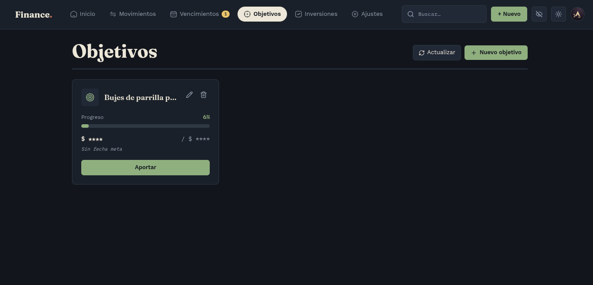
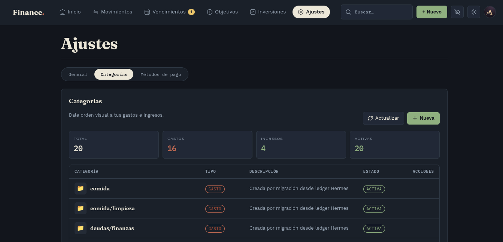
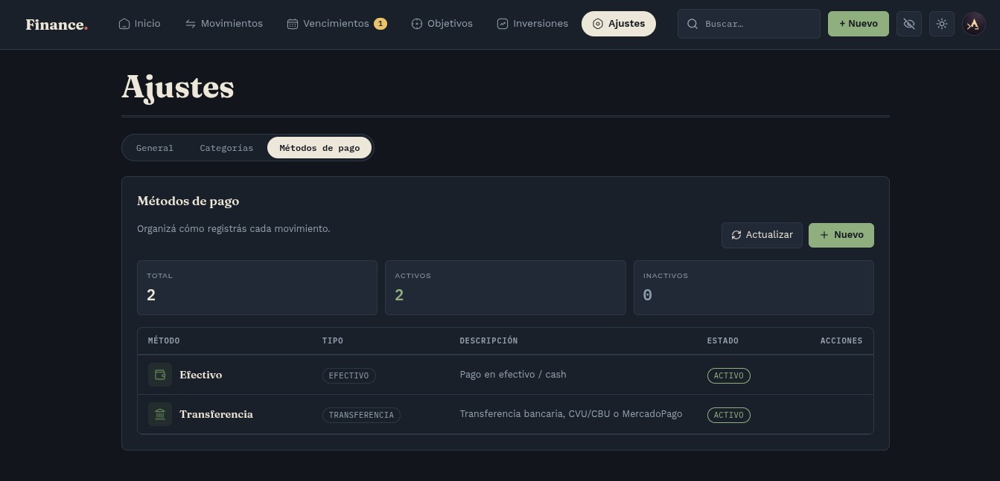

<div align="center">

# Sistema de Gastos Inteligente

Finanzas personales, un solo usuario, tema editorial "Papel" y modo oscuro

</div>

---

## Funcionalidades

- **Inicio**: resumen del mes (ingresos, gastos, balance), próximos vencimientos y últimos movimientos.
- **Movimientos**: ingresos y gastos con categorías, métodos de pago y varias monedas.
- **Vencimientos**: lo que hay que pagar, con tres vistas:
  - «Todos los vencimientos» (por defecto): todo lo impago, de cualquier mes.
  - «Vencimientos del mes»: solo el mes actual.
  - «Pagados»: el historial completo, del más reciente al más antiguo y agrupado por mes, para revisar los comprobantes.
  - Chips de categoría armados con las categorías de la lista y búsqueda. Cada vencimiento puede tener su comprobante (PDF o imagen).
- **Préstamos** (dentro de Vencimientos), **Objetivos** e **Inversiones** (cotizaciones del dólar y CEDEARs; los CEDEARs se cargan solo al abrir esa vista).
- **API keys** (en Ajustes) para agentes externos, que también pueden subir comprobantes (ver [`API_AGENTS.md`](./API_AGENTS.md)).
- Tema claro "Papel" y modo oscuro.

---

## Arquitectura


```
Internet (HTTPS)
      │
   Traefik  (reverse proxy + TLS)
      │
      ├── Frontend — React 18 + Vite (Nginx)
      │        │
      │        └── llama a ↓
      │
      └── Backend — FastAPI + Uvicorn
               │
               ├── PostgreSQL 16 (SQLAlchemy)
               └── MinIO / S3 (comprobantes)
```

La instalación local (`install.sh`) usa las mismas imágenes con Caddy en lugar de Traefik: un solo origen en `http://localhost:8080` que reparte `/api`, `/auth` y `/facturas` (comprobantes) hacia el backend y MinIO, y el resto hacia la app.

---

## Capturas

| Inicio | Movimientos |
|---|---|
|  |  |

| Vencimientos | Préstamos |
|---|---|
|  |  |

| Objetivos | Inversiones |
|---|---|
|  |  |

| Categorías | Métodos de pago |
|---|---|
|  |  |

---

## Instalación local en un comando (demo)

Solo necesitás [Docker](https://docs.docker.com/get-docker/) con Docker Compose:

```bash
curl -fsSL https://raw.githubusercontent.com/fer336/finanzas/main/install.sh | bash
```

El instalador deja todo en `~/finanzas` (Postgres, almacenamiento de comprobantes, API, app web y un proxy) y lo sirve en **http://localhost:8080**. Al terminar muestra el usuario de demo:

| Usuario | Contraseña |
|---|---|
| `demo@example.com` | `demo1234` |

- Las contraseñas internas se generan al azar en `~/finanzas/.env`.
- Volver a correr el comando actualiza la instalación y conserva los datos.
- Variables opcionales: `FINANZAS_PORT=9090`, `FINANZAS_DIR=/otra/ruta`, `FINANZAS_VERSION=v1.0.40`, y `DEMO_EMAIL` / `DEMO_PASSWORD` (solo en la primera instalación). Por ejemplo: `curl -fsSL …/install.sh | FINANZAS_PORT=9090 bash`.
- Desde `~/finanzas`: `docker compose stop` la detiene, `docker compose up -d` la vuelve a iniciar, `docker compose logs -f backend` muestra los logs y `docker compose down -v` borra todo, incluidos los datos.
- La primera vez el backend crea las tablas en la base vacía, la cuenta demo y el bucket de comprobantes.

El login con usuario y contraseña existe **solo** en instalaciones locales: lo activa `LOCAL_AUTH_ENABLED`, que pone el instalador. Producción no lo define y sigue entrando solo con Google.

## Instalación para desarrollo

### Requisitos

Node.js 18+, Python 3.11+, PostgreSQL 16, MinIO (o cualquier S3 compatible) y, para entrar con Google, credenciales OAuth.

### Backend

```bash
cd backend
python -m venv venv && source venv/bin/activate
pip install -r requirements.txt
uvicorn main:app --reload --port 8000
```

### Frontend

```bash
cd frontend
npm install
npm run dev   # http://localhost:3000 (redirige /api al backend en :8000)
```

### Ingresar

- **Con Google**: el email debe estar en `AUTHORIZED_EMAILS` y existir en la tabla `usuarios` con `active = true`.
- **Con usuario y contraseña** (solo local): definí `LOCAL_AUTH_ENABLED=true` y `LOCAL_AUTH_PASSWORD` en `backend/.env`. Con una base vacía, `python scripts/bootstrap_local.py` crea las tablas y la cuenta demo.

### Tests

```bash
cd backend && python -m pytest -q tests        # requiere pytest y httpx
cd frontend && npm test && npm run lint && npm run build
```

---

## Variables de entorno

**`backend/.env`** (lista completa en `app/core/config.py`):

```env
SECRET_KEY=...
ACCESS_TOKEN_EXPIRE_MINUTES=1440
POSTGRES_HOST=...
POSTGRES_PORT=5432
POSTGRES_USER=postgres
POSTGRES_PASSWORD=...
POSTGRES_DB=sistema_financiero
GOOGLE_CLIENT_ID=...
GOOGLE_CLIENT_SECRET=...
AUTHORIZED_EMAILS=tu-email@ejemplo.com
SESSION_SECRET_KEY=...
DEV_FRONTEND_URL=http://localhost:3000
DEV_BACKEND_URL=http://localhost:8000

# Comprobantes (MinIO / S3)
MINIO_ENDPOINT=...
MINIO_ACCESS_KEY=...
MINIO_SECRET_KEY=...
MINIO_BUCKET_NAME=facturas
MINIO_SECURE=true
MINIO_PUBLIC_URL=https://...

# Login con contraseña: solo instalaciones locales, nunca en producción
LOCAL_AUTH_ENABLED=false
LOCAL_AUTH_EMAIL=demo@example.com
LOCAL_AUTH_PASSWORD=...
```

**`frontend/.env`** (opcional; en desarrollo Vite ya redirige `/api` a `localhost:8000`):

```env
VITE_DEV_BACKEND_URL=http://localhost:8000
VITE_GOOGLE_CLIENT_ID=...
```

---

## Documentación relacionada

- [`DESIGN.md`](./DESIGN.md) — tokens de diseño del tema Papel
- [`API_AGENTS.md`](./API_AGENTS.md) — guía de la API para agentes externos
- [`docs/ux-due-dates.md`](./docs/ux-due-dates.md) — comportamiento de la pestaña Vencimientos

---

<div align="center">

**Fernando Ariel Cassera** (fer336) — [GitHub](https://github.com/fer336) · fcassera@protonmail.com

</div>
